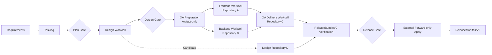
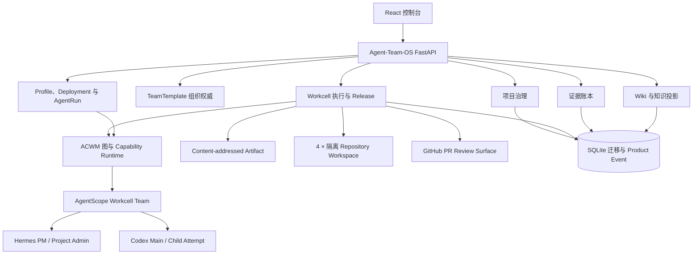

<div align="center">

# Agent-Team-OS

**面向本地 AI 软件团队的可信交付控制平面**

`v0.5.0` · `本地 Alpha` · `Python + FastAPI + React`

[完整产品文档](docs/product/AGENT-TEAM-OS-PRODUCT.md) · [English](README.en.md) · [快速开始](#五分钟本地启动) · [交付模型](#交付闭环) · [架构](#架构与职责边界) · [当前限制](#当前限制)

</div>

---

Agent-Team-OS 把多 Agent 产生的改动组织成可审查的软件交付。v0.5 中，Design、Frontend、
Backend 和 QA 是四个独立 `Agent Workcell`，各自绑定一个真实 Git Repository；它们不共享
Git Workspace，跨 Workcell 只传递内容寻址 Artifact。产品在 Agent Runtime 之外持有调度、验证、
评审、审批和 Forward-only Apply 权威。

> [!IMPORTANT]
> Agent-Team-OS 当前是本地 Alpha，不是生产稳定服务。Deterministic 四仓闭环只证明产品调度、
> Git 和证据状态机，不证明真实模型能力。Live 闭环需要已验证的 BMAD/TEA Method Store、Codex
> 登录、四个私有 GitHub HTTPS 仓库和可直推 `main` 的服务身份；任一缺失都必须标记为
> `blocked/not_run`。默认规划身份仍是 `codex-simulated-hermes`，不能作为真实 Hermes 证据。

## 当前架构


中文节点版本及节点对照见[中文架构图](readme-cn.md)。

## 交付闭环



产品明确区分六个事实：

1. Agent 产生了 Artifact；
2. 机器验证已经通过；
3. 用户接受了候选版本；
4. 每个 PR 仍绑定同一 Candidate SHA；
5. Git 精确应用了已审查的 Revision，并从远端回读相同 SHA；
6. 四仓 Apply Receipt 合成的 `ReleaseManifestV2` 已激活。

外部仓库部分 Apply 后会进入 `needs_attention`：不回滚、不激活 Manifest，只能在原 Bundle
仍满足已应用仓=Candidate、未应用仓=Base 时执行 `resume-forward`。

## 为什么需要 Agent-Team-OS

Agent 能修改文件，不代表代码已经可以安全交付。Agent-Team-OS 在 Agent Runtime 外建立产品级控制：

| 交付风险 | 产品控制 |
|---|---|
| 审批后计划被悄悄替换 | Gate Subject Hash 与乐观版本 |
| Agent 修改错误文件 | 系统固定允许路径并核对真实 Git Diff |
| 产物包含凭据或秘密材料 | 进入人工审查前执行候选秘密扫描 |
| 模型文本声称测试通过 | 固定机器命令、退出码和日志哈希 |
| Candidate 基线已经变化 | Managed Git 使用 CAS；External Git 在 Apply 前重新 Fetch 并要求 `main == reviewed base` |
| 重启后任务永久显示运行中 | 持久化状态、执行中断失败与 Apply 恢复 |
| UI 文本被误认为交付成功 | 不可变 Evidence 与显式 Runtime Identity |

## 模块总览

| 模块 | v0.5 本地 Alpha 已有能力 | 明确边界 |
|---|---|---|
| **组织与项目** | TeamTemplate Revision、四 Workcell 拓扑、独立 Repository Binding/验证/激活 | Team 不定义 Stage、Provider 或真实仓库；暂无项目级 RBAC |
| **Workcell 执行** | 可观察 Main/Child/Attempt、冻结 Slot、取消/超时/中断、机器验证和结构化 Review | Child 深度最多 1；一个 Workcell 最多一个 Writer |
| **交付与发布** | 四仓 Candidate Lineage、ReleaseBundleV2、GitHub PR、Forward-only Apply、Resume 和 Manifest | GitHub PR 仅是评审面；v0.5 不使用 Provider-native Merge |
| **Method Pack** | 内容寻址 BMAD/TEA Store、完整性校验、临时只读 Codex Overlay | 不执行不受信安装脚本，不暴露 Party Mode，不污染业务仓库 |
| **看板** | 可重建的项目级 WorkItem 与合法命令 | 拖动表达命令，不能伪造完成状态 |
| **可视化编排** | 多流水线、React Flow DAG、条件边和有界 LOOP | LOOP 内禁止人工 Gate |
| **智能体** | Agent Profile、不可变 Revision、Deployment、运行实例、Provider Manifest 与资格检查 | Runtime Feature 来自可信 Adapter，浏览器不可伪造 |
| **知识中心** | 项目/全局 Wiki、版本、评论、FTS5、Provider Snapshot 与项目知识动态 | 不含 Embedding、RAG 回答生成和长期 Agent Memory |
| **证据** | 只追加交付事实、SHA-256 完整性与重新验证历史 | Evidence 可提炼为 Wiki，但本体永远不可编辑 |
| **设置** | Readiness、发布门禁状态和安全运营配置 | 系统安全硬限制不可由界面放宽 |

## 项目评测

Agent-Team-OS 建立了独立 Evaluation 评测域，用于可重复验证能力、交付质量和控制面性能。
每次运行都会冻结 Pipeline Revision、Deployment 绑定、ACWM 与 Git 修订、数据集及评分器身份；
报告按维度并列展示，不生成误导性综合分。

最新已发布基线：**2026-08-24，suite 1.2.0，offline standard，seed 20260824**。

| 评测维度 | 已评测/总数 | 结果 | 可证明范围 |
|---|---:|---:|---|
| ToolCall / BFCL-compatible | 300/300 | 300 通过 | AST 归一化与 Fixture Trace 评分链路 |
| General Agent / GAIA-compatible | 180/180 | 180 通过 | 类型感知的准精确 Fixture 评分 |
| Data Generation | 60/60 | 60 平局 | 同一冻结对象未产生虚假质量差异 |
| Control Plane | 60/60 | 60 通过 | 本地 GraphRun、CAS、恢复、SQLite 和 ASGI 探针 |

本地控制面观测：

| 指标 | p50 | p95 | p99 |
|---|---:|---:|---:|
| 候选侧 HTTP 时延 | 2.36 ms | 6.29 ms | 9.43 ms |
| 候选侧 GraphRun 总时延 | 8.80 ms | 101.03 ms | 121.81 ms |

- 门禁：`passed`；证明范围：`fixture_harness_only`；官方 Benchmark：`false`。
- Evidence SHA-256：`d9e2019fa6e86f632e0d3d513f04cf7a73d3de55065e05f845919080ead3e2c6`。
- `134 passed, 1 skipped` 是当时的软件测试基线；上述 600 条是评测工作负载观测，分母不同。
- Deterministic Fixture **不能**证明真实模型能力、官方 BFCL/GAIA 排名、独立生成质量、Token/成本
  或生产网络 SLA。未配置 Live Runtime 时，Case 状态为 `blocked`、Run 状态为 `blocked`、
  Report Gate 为 `not_run`；不同对象缺少独立 Judge 时保持 `blocked`。

详见[评测方法论](docs/evaluation/METHODOLOGY.md)、
[版本化数据集卡](evaluation/datasets/agent-team-os-mvp/1.3.0/README.md)、
[脱敏历史基线](docs/evaluation/results/2026-08-24-offline-standard.md)、
[PR/Push CI](.github/workflows/ci.yml) 和[手动完整评测](.github/workflows/evaluation.yml)。

发布基线属于历史 Suite 1.2.0；当时用例内嵌在代码中，当前仓库不将其冒充为可重放数据集。
后续可重复验证使用版本化 Suite 1.3.0；修改用例或 Schema 会改变 SHA-256，并要求重新校准。

## 五分钟本地启动

### 前置条件

- Python `>=3.11,<3.13`
- [`uv`](https://docs.astral.sh/uv/)
- Git
- Node.js 与 pnpm（`console/package.json` 固定 `pnpm@10.13.1`）
- 已安装并登录 Codex CLI，用于真实代码执行

仓库当前没有发布安装包或 GitHub Release。从源码启动：

```bash
git clone https://github.com/Jinchengawu/DEV-Agent-Teams-V2.git
cd DEV-Agent-Teams-V2

uv sync --extra dev --extra live
pnpm --dir console install --frozen-lockfile
.venv/bin/python scripts/install_method_packs.py
.venv/bin/python scripts/poc_method_pack_overlay.py
uv run --extra live agent-team-os demo
```

打开 <http://127.0.0.1:8080>。全新数据目录首次访问时，控制台会要求创建本地管理员。密码至少 12 位，并同时包含字母和数字。

运行数据默认保存在 `.agent-team-os/`。需要一次性环境时可以指定独立目录：

```bash
AGENT_TEAM_OS_DATA_DIR=/tmp/agent-team-os-demo \
  uv run --extra live agent-team-os demo
```

### 第一次可观察成功

1. 确认 Readiness 中 ACWM、AgentScope、Git、Codex 登录和 `method-packs:bmad-tea-v050` 全部 Ready。
2. 在“组织模板”查看或发布 TeamTemplate Revision；此处不编辑 Pipeline Stage 顺序。
3. 创建 Workcell 项目，分别绑定 Design、Frontend、Backend、QA 四个不同仓库并逐仓验证。
4. 四仓 Ready 后激活 Team，使用 `agent-workcell-delivery` 创建交付。
5. 审查 Plan Gate 和 Design Gate，在 Delivery 详情查看 Main/Child/Attempt、Method Hash 和 Artifact。
6. 审查四个 Candidate、机器 Verification、ReviewArtifact 和 GitHub PR，批准同一 ReleaseBundle Hash。
7. 确认四份 Remote Apply Receipt 与 `ReleaseManifestV2` 一致；部分 Apply 只能按原 Bundle
   `resume-forward`。

如果缺少依赖，系统会 Fail Closed 并返回修复动作，不会静默切换到确定性模型。

## 产品模块

### 项目与交付

旧 Project 继续使用单一受管 Git Workspace。Workcell Project 则绑定一个 TeamTemplate Revision 和多个
`WorkspaceBinding`，每个 Workcell 只有一个可写 Primary Repository。Delivery 会冻结 Project、Team、
Pipeline、Provider、Workspace 和 Method Pack 五类 Revision。v0.5 的项目级 Lease 仍阻止两个活动
Delivery 并发，但允许同一 Delivery 内 Frontend/Backend Workcell 和不同 Repository 并行。

进入终态后释放租约。已归档项目可以继续查询，但不能启动 Delivery、重置 Workspace 或修改资源绑定。

### 看板

看板是由事件构建的投影，不是另一套任务状态机。各列反映 Delivery、Stage 与 Gate 事实。批准、拒绝、取消等命令由权威领域验证；任意拖动不能把执行中卡片直接变成已完成。

### 可视化编排

流水线草稿支持语义 DAG 依赖、条件边和有界 LOOP。校验并发布后会冻结包含 Graph、Agent Assignment、Provider Binding 与指纹的不可变 Revision。新 Delivery 固定引用该 Revision，不会跟随可变的“最新版本”。

内置 Backend 流水线包含需求分析、任务规划、计划 Gate、有界代码修复 LOOP 和候选 Gate。

### Agent 管理

Agent Catalog 将可复用角色语义与环境运行配置分离：

```text
AgentProfileSpec
  -> AgentDeployment
  -> Runtime Instance + Adapter
  -> Provider Manifest
  -> 冻结 Pipeline Assignment
  -> AgentRun + ArtifactEnvelope
```

策略允许时，一个实例可以承载多个 Shared Profile；Dedicated Deployment 会拒绝冲突占用。Qualification 会检查已发布 Profile Revision、实例健康与版本、可信 Adapter Feature、Provider Capability 和策略边界。

### 知识与证据

知识检索统一展示不同来源，但不合并其权威语义：

- **Wiki**：可编辑、可恢复版本的项目或全局知识；
- **Evidence**：不可变交付事实，可以重新验证；
- **Provider Snapshot**：内容寻址的外部知识，包括飞书 Provider 边界。

已验证 Evidence 可以显式提炼成 Wiki 文档。Derivation 会保存来源 ID、Revision 与 SHA-256，但不会让原始 Evidence 变得可编辑。

## 架构与职责边界



| 权威方 | 职责 |
|---|---|
| **ACWM** | 跨 Stage 的 Workflow、Capability、Provider、Artifact 与 Gate 语义 |
| **AgentScope** | Stage 内的通信与 Agent 组合 |
| **Hermes 兼容实例** | 显式配置后承担 PM 与 Project Admin 角色智能 |
| **Codex** | 受控代码执行，以及当前模拟规划 Adapter |
| **Agent-Team-OS** | 身份、权限、项目、Git 安全、候选校验、机器验证、审批、应用策略、证据和 UI |

Agent-Team-OS 不复制 ACWM Runtime Contract，也不会让 AgentScope 接管跨 Stage 的产品状态机。

详细架构决策位于 [`docs/architecture/`](docs/architecture/)：

- [模块化单体边界](docs/architecture/ADR-0002-MODULAR-MONOLITH.md)；
- [SQLite 事务与 Product Event](docs/architecture/ADR-0003-SQLITE-UOW-EVENTS.md)；
- [Evidence 可信度](docs/architecture/ADR-0005-EVIDENCE-TRUST.md)；
- [多流水线 DAG/LOOP](docs/architecture/ADR-0009-MULTI-PIPELINE-DAG-LOOP.md)；
- [Agent Profile 与 Deployment](docs/architecture/ADR-0010-AGENT-PROFILES-AND-DEPLOYMENTS.md)；
- [项目治理与 Workspace 隔离](docs/architecture/ADR-0011-PROJECT-GOVERNANCE.md)；
- [Agent Workcell 权威与隔离工作区](docs/architecture/ADR-0014-AGENT-WORKCELL-AUTHORITY.md)；
- [外部 Git Forward-only Release](docs/architecture/ADR-0015-EXTERNAL-FORWARD-ONLY-RELEASE.md)；
- [v0.5.0 交付说明](docs/releases/V0.5.0-AGENT-WORKCELL-KERNEL.md)。

## 运行身份

| 路径 | 当前身份 | 可以证明什么 |
|---|---|---|
| 默认需求/任务规划 | `codex-simulated-hermes` | Codex 执行了结构化规划 Adapter；不能证明调用了 Hermes |
| Workcell Main / Child Attempt | `codex-cli` | Codex 在冻结 Slot、Workspace Access 和临时 Method Overlay 内执行；不允许隐藏派生 |
| 确定性四仓门禁 | `deterministic-test` | 只证明 Workcell、Artifact、Git、PR Receipt 和 Forward-only 状态机，不证明真实模型质量 |
| Hermes Adapter | `hermes-acp` / `hermes-http` | 可注册并健康检查；真实使用必须显式配置并产生对应证据 |

未知或未验证 Artifact 可以被审计，但不能驱动 Delivery 成功。

## 安全与数据边界

- Demo 默认只监听 `127.0.0.1`。
- 本地身份使用 scrypt 密码哈希、Session、CSRF/Origin 检查和角色权限。
- 凭据字段接受环境变量或 Keychain 引用；设计上不应把秘密值写入 API 响应或 SQLite。
- 浏览器不能决定真实 Workspace 路径、机器验证命令或可信 Runtime Feature。
- Codex Writer 在本 Workcell 的隔离可写 Worktree 中执行；Reviewer 只读同仓的 Detached Candidate View。
- 其他 Workcell Repository 不会挂载；跨 Workcell 只传递已校验的 Artifact Reference。
- BMAD/TEA 只从内容寻址 Store 构建临时只读 Overlay，不进入业务仓库 Diff。
- 空修改、越界修改、秘密材料、非法 Artifact、超时和固定测试失败都会在候选审批前 Fail Closed。
- Managed Git V1 保留 CAS Compensation；External Git 只做非 Force Fast-forward，部分 Apply 不自动回滚。
- Evidence 只追加并进行内容寻址；重新验证追加新结果，不覆盖历史。

本地 Alpha 尚未经过独立安全审计。不要直接暴露到不可信网络，也不要用于敏感真实仓库。

## 验证与发布门禁

开发检查：

```bash
uv run ruff check src tests
uv run mypy src/agent_team_os
uv run pytest -q

pnpm --dir console typecheck
pnpm --dir console test
pnpm --dir console build
```

v0.5 Workcell 门禁：

```bash
# 领域约束、四仓 Pipeline 和 Forward-only 恢复语义
.venv/bin/python -m pytest -q \
  tests/test_workcell_execution_kernel.py \
  tests/test_workcell_pipeline_e2e.py \
  tests/test_external_forward_release_v2.py

# 真实 BMAD/TEA 归档、Codex Method Entry 发现与业务仓无污染
.venv/bin/python scripts/install_method_packs.py
.venv/bin/python scripts/poc_method_pack_overlay.py

# Deterministic 浏览器四仓闭环：使用会话级评测密码与独立数据目录
.venv/bin/python scripts/browser_workcell_e2e.py --help
```

`browser_workcell_e2e.py` 需要由门禁驱动器启动 `agent_team_os.gate_app`，并通过
`AGENT_TEAM_OS_TEST_PASSWORD` 注入独立的会话级评测密码。它使用四个真实本地 Bare Git
Remote，但 Agent 边界是 Deterministic，不是 Live 模型证据。

保留的 v0.4 单仓回归门禁：

```bash
uv run --extra live agent-team-os gate

# 真实 Codex 规划 Adapter 与真实 Codex 代码执行
uv run --extra live agent-team-os gate --live

# 顺序运行 deterministic/live，并生成组合结论
uv run --extra live agent-team-os release
```

报告必须绑定同一 DEV/ACWM Revision、Pipeline Revision、Graph Fingerprint、GraphRun、
Candidate/Bundle/Manifest Hash、机器验证、Runtime Identity 和远端 SHA 回读。缺失、过期、
损坏、包含 skipped/WARN 或 Revision 不一致的证据不能形成发布通过状态。

2026-08-31 当前 v0.5 工作树开发验证（尚未生成正式同 Revision Release Report）：

| 检查 | 实际结果 | 证明范围 |
|---|---:|---|
| Python 测试 | 210 passed，1 skipped | skipped 为需要显式 Live Codex 的原有集成探针 |
| React 测试 | 66 passed | 组件、控制器和 Workcell 语义 |
| Ruff / strict Mypy / TypeScript | 通过 | 静态检查 |
| Vite 生产构建 | 通过 | 本地可构建性 |
| Deterministic 四仓浏览器闭环 | 通过 | 4 个独立 Remote、5 个 WorkcellRun、4 个 PR/Receipt、`main == Candidate` |
| BMAD/TEA Overlay PoC | 通过 | 归档/内容/资格哈希、Codex 入口发现与无仓库污染 |
| 真实 Codex 规划探针 | failed: 120s timeout | 不能作为 Live 通过证据 |
| 四 Workcell Live Release | `blocked/not_run` | 未提供 4 个私有 GitHub 评测仓库和直推 `main` 授权 |

因 Live 条件不满足且当前工作树尚未提交，v0.5 不得声称已完成最终发布验收。

## 当前限制

- v0.5 只实现 `git_repository_v1`；Document/Case/Ledger/Dataset 等 Workspace Adapter 尚未实现。
- 一个 Project 最多一个活动 Delivery；暂无 Workspace-Set 跨 Delivery Lease、Delta Release 和 Manifest Version CAS。
- Child 深度固定为 1，每个 Workcell 最多 3 个 Child、2 个并发、1 个 Writer。
- External Git Live 参考实现只支持 GitHub HTTPS 与 `env://` / `keychain://` 凭据引用；不管理 SSH 凭据。
- 仓库保护若禁止服务身份直推 `main`，该仓库不能通过 v0.5 Live Readiness；v0.5 不使用 Provider-native PR Merge。
- 默认由 Codex 模拟 Hermes PM/Admin；真实 Hermes 尚不是发布门禁。
- 没有 Embedding、RAG 回答生成、共享长期 Agent Memory 或多租户。
- 尚未实现项目级 RBAC；当前角色作用于整个控制平面。
- v0.5 当前工作树没有发布安装包、Git Tag 或 GitHub Release。
- 仓库当前没有 License；公开可见不代表获得复用授权。

## Roadmap 方向

以下能力明确后移到 v0.6：

1. Workspace-Set 跨 Delivery Lease；
2. Delta ReleaseBundle、Manifest Version CAS 和并行 Manifest 合成；
3. Document/Case/Ledger/Dataset Workspace Adapter；
4. 二级子 Agent；
5. Provider-native PR Merge。

Roadmap 不是当前能力。

## 适合谁

Agent-Team-OS 适合：

- 正在开发 Coding Agent 或 Agent Team，需要受治理交付生命周期的工程师；
- 希望验证 DAG/LOOP、人工审批和 Git 安全如何组合的架构师；
- 研究 ACWM、AgentScope、Hermes 与 Codex 职责边界的人；
- 学习 Agent 产品中 Evidence、恢复、幂等和 CAS 的开发者。

当前不适合：

- 需要托管生产 Agent 平台的团队；
- 只允许 PR Merge、不允许服务身份直推 `main` 的仓库；
- 需要通用多 Agent 聊天界面的产品；
- 需要内置 RAG、向量检索或长期 Memory 的应用；
- 需要已经具备 OSI License、可以直接再分发的依赖方。

## 仓库结构

```text
src/agent_team_os/       Python 产品与基础设施模块
console/                 React/Vite 控制台
config/                  ACWM Capability、Journey 与框架锁
migrations/              带 Checksum 的 SQLite 迁移
docs/architecture/       架构决策记录
docs/design/             产品与集成设计
scripts/                 OpenAPI 与浏览器验证工具
tests/                   单元、合同、集成和发布行为测试
tasks/spark/             版本化、受限的实现任务清单
reviews/spark/           候选代码审查记录
```

## 参与开发

仓库当前还没有正式贡献指南。提交修改前：

1. 阅读 [`AGENTS.md`](AGENTS.md) 和相关 ADR；
2. 保持 ACWM 为跨 Stage 语义权威；
3. 保持 AgentScope 只负责 Stage 内组合；
4. 保留产品层对权限、Git 安全、Evidence、审批和应用策略的所有权；
5. 为纵切功能增加公共接口测试，不得把确定性证据描述成真实 Agent 证据。

可以通过 GitHub Issue 提交可复现缺陷或架构提案。不要上传凭据、私有仓库内容或本地 `.agent-team-os/` 数据。

## License

仓库当前没有 License 文件。在维护者添加明确许可证之前，版权法默认保留复用、修改和再分发权利；仓库公开可见不应被理解为开源授权。
