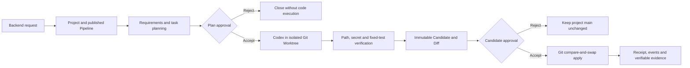
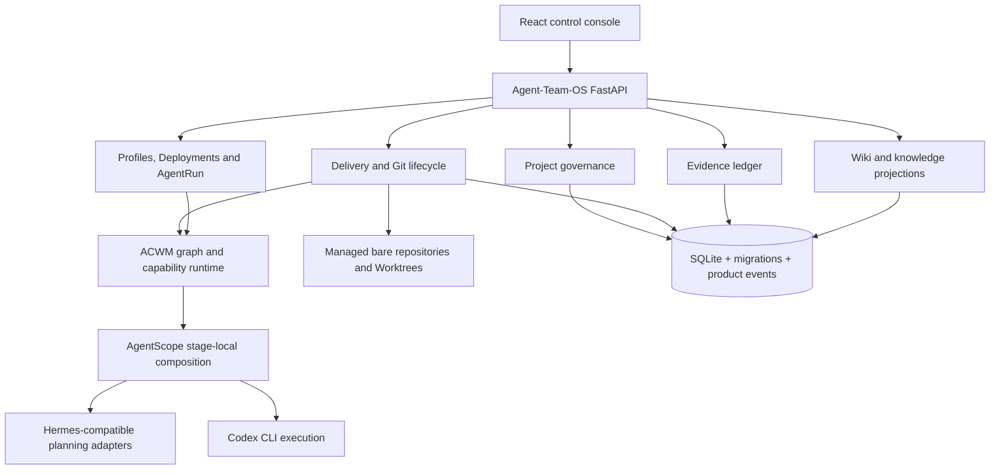

<div align="center">

# Agent-Team-OS

**An evidence-gated delivery control plane for local AI software teams**

`v0.4.0` · `local alpha` · `Python + FastAPI + React`

[中文](README.zh-CN.md) · [Quickstart](#five-minute-local-start) · [Delivery model](#the-delivery-loop) · [Architecture](#architecture-and-ownership) · [Limits](#current-limitations)

</div>

---

Agent-Team-OS turns an AI-generated code change into a reviewable software delivery: a request is planned, approved, executed in an isolated Git Worktree, verified by fixed machine checks, reviewed as an immutable candidate, and either applied with compare-and-swap or rejected without changing `main`.

> [!IMPORTANT]
> Agent-Team-OS is a local alpha, not a production-ready service. The current real execution path targets the built-in standard-library Python backend sandbox. Planning defaults to the explicitly labelled `codex-simulated-hermes` identity; it is not evidence of a real Hermes call.

## The delivery loop



The product keeps four facts separate:

1. the Agent produced an Artifact;
2. machine verification passed;
3. a user accepted the candidate;
4. Git applied the exact reviewed revision.

Only a complete apply receipt can finish an accepted delivery.

## Why this project exists

An Agent being able to edit files does not make the change safe to ship. Agent-Team-OS places product-owned controls around Agent runtimes:

| Delivery risk | Product control |
|---|---|
| A plan silently changes after approval | Gate subject hash and optimistic version |
| An Agent edits the wrong files | System-owned allowed paths and actual Git Diff validation |
| Output contains credentials or secret material | Candidate secret scan before human review |
| A model says tests passed | Fixed machine verification with exit code and log hash |
| A candidate is applied to a changed base | Atomic `git update-ref <candidate> <base>` compare-and-swap |
| A restart leaves work looking active forever | Persisted state, interrupted-run failure and apply recovery |
| UI text is mistaken for a successful delivery | Immutable Evidence records and explicit runtime identities |

## Module overview

| Module | Available in v0.4 local alpha | Deliberate boundary |
|---|---|---|
| **Projects** | Project lifecycle, independent Git workspace, fixed Pipeline binding and Deployment access | No project-level RBAC yet |
| **Deliveries** | Request, two approvals, real Candidate/Diff, fixed tests, reject/apply and history | Built-in Python backend only |
| **Board** | Rebuildable project-scoped work items and legal commands | Dragging expresses a command; it cannot forge completion |
| **Orchestration** | Multiple Pipelines, React Flow DAG editor, conditional edges and bounded LOOP | Human Gates inside LOOP bodies are rejected |
| **Agents** | Agent Profiles, immutable revisions, Deployments, runtime instances, Provider manifests and qualification | Runtime features come from trusted adapters, not browser input |
| **Knowledge** | Project/global Wiki, revisions, comments, FTS5 search, provider snapshots and project knowledge activity | No embeddings, RAG answer generation or long-term Agent memory |
| **Evidence** | Append-only delivery facts, SHA-256 integrity and re-verification history | Evidence can be derived into Wiki, but is never made editable |
| **Settings** | Readiness, release-gate status and safe operational configuration | Hard security policy remains system-owned |

## Five-minute local start

### Prerequisites

- Python `>=3.11,<3.13`
- [`uv`](https://docs.astral.sh/uv/)
- Git
- Node.js and pnpm (`pnpm@10.13.1` is pinned in `console/package.json`)
- an installed and logged-in Codex CLI for the real code-execution path

The repository does not currently publish a package or GitHub Release. Until the default branch is moved to v0.4, clone the verified branch explicitly:

```bash
git clone --branch codex/v04-experience-completeness \
  https://github.com/Jinchengawu/DEV-Agent-Teams-V2.git
cd DEV-Agent-Teams-V2

uv sync --extra dev --extra live
pnpm --dir console install --frozen-lockfile
uv run --extra live agent-team-os demo
```

Open <http://127.0.0.1:8080>. On a fresh data directory, the console asks you to create the first local administrator. Passwords must contain letters and numbers and be at least 12 characters long.

Runtime state is stored under `.agent-team-os/` by default. Use a separate directory when you want a disposable environment:

```bash
AGENT_TEAM_OS_DATA_DIR=/tmp/agent-team-os-demo \
  uv run --extra live agent-team-os demo
```

### First observable success

1. Confirm that Readiness reports ACWM, AgentScope, Git and Codex login as ready.
2. Open **Projects** and select the initialized project.
3. In **Deliveries**, select an enabled immutable Pipeline revision and submit a bounded backend request.
4. Review the requirement and task Artifact, then approve the plan.
5. Wait for the real Codex Worktree execution and fixed machine verification.
6. Review the unified Diff, Candidate revision, changed files, test command and hashes.
7. Reject to prove that project `main` is unchanged, or accept to apply the exact Candidate revision.
8. Open **Evidence** and **Knowledge** to inspect the receipt and project knowledge activity.

If a dependency is missing, startup fails closed and Readiness returns a repair action instead of silently switching to a deterministic model.

## Product surfaces

### Projects and Deliveries

Each active Project has its own managed Git workspace. A Delivery freezes its Project, Pipeline revision, Agent binding snapshots and policy fingerprints. A project-scoped lease prevents two active deliveries from mutating the same project workspace concurrently.

Terminal states release the lease. Archived projects remain readable but cannot start deliveries, reset their workspace or change resource bindings.

### Board

The Board is an event-derived projection, not another task state machine. Its columns reflect Delivery, Stage and Gate facts. Commands such as approve, reject or cancel are validated by the owning domain; an arbitrary drag cannot turn an executing item into a completed item.

### Visual orchestration

Pipeline drafts support semantic DAG dependencies, conditional edges and bounded LOOP nodes. Validation and publication freeze an immutable revision containing graph, Agent assignments, Provider bindings and fingerprints. New Deliveries pin that revision instead of following a mutable “latest” definition.

The built-in backend flow contains requirements, tasking, a plan Gate, a bounded code-repair LOOP and a candidate Gate.

### Agent management

The Agent catalog separates reusable role intent from environment-specific execution:

```text
AgentProfileSpec
  -> AgentDeployment
  -> Runtime Instance + Adapter
  -> Provider Manifest
  -> frozen Pipeline assignment
  -> AgentRun + ArtifactEnvelope
```

An instance can host multiple shared Profiles when policy allows it. A dedicated Deployment rejects conflicting use. Qualification checks published Profile revisions, instance health/version, trusted adapter features, Provider capabilities and policy bounds.

### Knowledge and Evidence

Knowledge search presents different source types together without merging their authority:

- **Wiki** — editable, versioned project or global knowledge;
- **Evidence** — immutable delivery facts that can be re-verified;
- **Provider snapshot** — content-addressed external knowledge, including the Feishu provider boundary.

Verified Evidence can be explicitly derived into a Wiki document. The derivation records the source ID, revision and SHA-256; it does not make the original Evidence editable.

## Architecture and ownership



| Owner | Responsibility |
|---|---|
| **ACWM** | Cross-stage Workflow, Capability, Provider, Artifact and Gate semantics |
| **AgentScope** | Communication and Agent composition inside a Stage |
| **Hermes-compatible instances** | PM and Project Admin role intelligence when explicitly configured |
| **Codex** | Controlled code execution and the current simulated planning adapter |
| **Agent-Team-OS** | Identity, permissions, Projects, Git safety, Candidate validation, verification, approvals, apply policy, evidence and UI |

Agent-Team-OS does not copy ACWM runtime contracts and does not ask AgentScope to own the cross-stage product state machine.

Architecture decisions are documented under [`docs/architecture/`](docs/architecture/), including:

- [modular-monolith boundaries](docs/architecture/ADR-0002-MODULAR-MONOLITH.md);
- [SQLite transactions and Product Events](docs/architecture/ADR-0003-SQLITE-UOW-EVENTS.md);
- [Evidence trust](docs/architecture/ADR-0005-EVIDENCE-TRUST.md);
- [multi-Pipeline DAG/LOOP semantics](docs/architecture/ADR-0009-MULTI-PIPELINE-DAG-LOOP.md);
- [Agent Profiles and Deployments](docs/architecture/ADR-0010-AGENT-PROFILES-AND-DEPLOYMENTS.md);
- [Project governance and workspace isolation](docs/architecture/ADR-0011-PROJECT-GOVERNANCE.md).

## Runtime identities

| Path | Current identity | What it proves |
|---|---|---|
| Default requirements/task planning | `codex-simulated-hermes` | Codex executed the structured planning adapter; it does **not** prove Hermes was called |
| Code delivery | `codex-cli` | Codex ran with workspace-write in the managed Worktree |
| Deterministic gate | `deterministic-test` | Product and Git lifecycle behavior only; never live-model quality |
| Hermes adapters | `hermes-acp` / `hermes-http` | Available for registration and health checks; live use requires explicit configuration and evidence |

Unknown or unverified Artifact types remain auditable but cannot drive Delivery success.

## Security and data boundaries

- The demo binds to `127.0.0.1` by default.
- Local identity uses scrypt password hashes, sessions, CSRF/origin checks and role-based permissions.
- Credential fields accept environment-variable or keychain references; raw secret values are not intended for API responses or SQLite records.
- Browser input cannot choose real workspace paths, validation commands or trusted runtime features.
- Codex executes inside a managed Worktree with system-owned allowed paths.
- Empty changes, path escapes, secret-bearing changes, invalid Artifacts, timeouts and failed fixed tests fail closed before candidate review.
- Reject does not update project `main`; accept uses the reviewed base and candidate revisions in a Git compare-and-swap.
- Evidence is append-only and content-addressed; re-verification appends a result instead of overwriting history.

This local alpha has not undergone an independent security audit. Do not expose it directly to an untrusted network or point it at sensitive repositories.

## Verification and release gates

Developer checks:

```bash
uv run ruff check src tests
uv run mypy src/agent_team_os
uv run pytest -q

pnpm --dir console typecheck
pnpm --dir console test
pnpm --dir console build
```

Delivery gates:

```bash
# Real Git lifecycle with deterministic model boundaries
uv run --extra live agent-team-os gate

# Real Codex planning adapter and real Codex code execution
uv run --extra live agent-team-os gate --live

# Run deterministic and live gates and combine their reports
uv run --extra live agent-team-os release
```

Gate reports include DEV and ACWM revisions, Pipeline revision, graph fingerprint, GraphRun status, Candidate revision, Diff SHA-256, verification result, runtime identities and an evidence hash. Missing, stale, corrupt, skipped, warning-bearing or revision-mismatched evidence cannot produce a release-passed state.

The baseline audited before this README update was commit `e3f8d9d` on 2026-08-25:

| Check | Observed result | Scope |
|---|---:|---|
| Python tests | 134 passed, 1 existing skipped | Local automated behavior |
| React tests | 51 passed | Component and controller behavior |
| Ruff / strict Mypy / TypeScript | Passed | Static checks |
| Vite production build | Passed | Local buildability |
| Browser smoke | 5 graph nodes visible, 7 historical knowledge items, no console errors | Selected local UI path |

These checks do not establish production availability, external adoption, live Hermes behavior or a public benchmark ranking.

## Current limitations

- Real code execution supports the built-in standard-library Python backend sandbox, not arbitrary user repositories.
- Planning defaults to Codex simulating Hermes PM/Admin; real Hermes is not a release requirement yet.
- Frontend code execution, multi-task delivery and cloud deployment are not supported.
- There is no embedding pipeline, RAG answer generation, shared long-term Agent memory or multi-tenancy.
- Project-level RBAC is not implemented; current roles are control-plane-wide.
- No package, Git tag, GitHub Release or maintained CI result is published for v0.4.
- The repository currently has no license file. Public visibility alone does not grant reuse rights.

## Roadmap direction

Planned work remains subject to architecture review and evidence gates:

1. adapt the delivery boundary to real user Git repositories;
2. qualify real Hermes planning as a release-gated runtime identity;
3. extend execution beyond the backend sandbox;
4. deepen project authorization and operational isolation;
5. add richer AgentScope-native teams, communication and memory only where they do not duplicate ACWM or product governance.

Planned items are not current capabilities.

## Who this is for

Agent-Team-OS is useful if you are:

- building a Coding Agent or Agent Team and need a governed delivery lifecycle;
- evaluating how DAG/LOOP orchestration, human approval and Git safety fit together;
- designing explicit ownership across ACWM, AgentScope, Hermes and Codex;
- studying evidence, recovery, idempotency and compare-and-swap in Agent products.

It is not currently the right choice if you need:

- a hosted production Agent platform;
- arbitrary repository support with enterprise isolation;
- a general-purpose multi-Agent chat UI;
- built-in RAG, vector search or long-term memory;
- an OSI-licensed dependency that can already be redistributed without further permission.

## Repository map

```text
src/agent_team_os/       Python product and infrastructure modules
console/                 React/Vite control console
config/                  ACWM capabilities, journeys and framework lock
migrations/              Checksummed SQLite migrations
docs/architecture/       Architecture Decision Records
docs/design/             Product and integration designs
scripts/                 OpenAPI and browser verification helpers
tests/                   Unit, contract, integration and release behavior tests
tasks/spark/             Versioned bounded implementation task manifests
reviews/spark/           Tracked candidate review records
```

## Contributing

The repository does not yet include a formal contribution guide. Before proposing a change:

1. read [`AGENTS.md`](AGENTS.md) and the relevant ADR;
2. keep ACWM as the cross-stage semantic authority;
3. keep AgentScope inside Stage-local composition;
4. preserve product ownership of permissions, Git safety, evidence, approval and apply policy;
5. add a vertical public-interface test and do not present deterministic evidence as live Agent evidence.

Use GitHub Issues for reproducible defects or architecture proposals. Do not include credentials, private repository contents or local `.agent-team-os/` data.

## License

No license file is currently present. Until the maintainer adds an explicit license, copyright law reserves reuse, modification and redistribution rights. Repository visibility should not be interpreted as an open-source grant.
