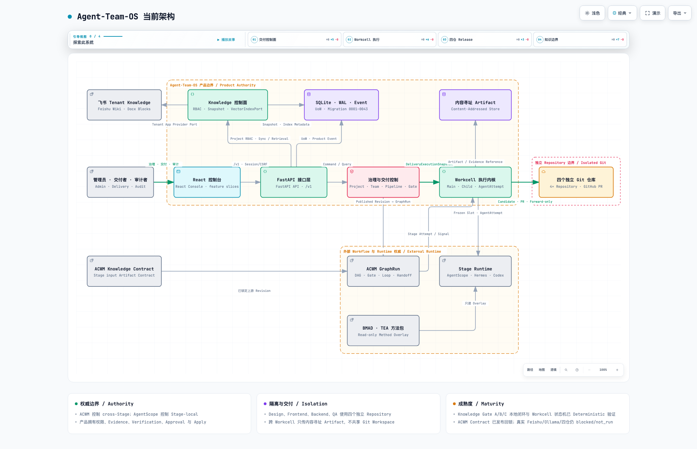

# Agent-Team-OS 当前架构总览

> 本文是后续 Agent 理解当前工程的第一入口，以及已接受架构变更的状态索引。
> 它综合解释当前 Revision 中已经存在的边界，不替代代码、Migration、OpenAPI、测试证据或 ADR。

当前实现分支以 `main@cfe597c05b3b0c65af57bf12d14b7f802fe7899f` 为基线；本文所在 Revision
新增了受 Feature Flag 保护的 v0.5.1 Knowledge Gate A/B/C 执行原语与 Deterministic 浏览器
闭环。代码存在、Deterministic 测试通过和正式 Live Release 验收是三种不同事实：
真实 Feishu/Ollama、已发布并锁定的 ACWM Stage Input Artifact Contract Revision、四仓 GitHub
与同 Revision Release Report 仍为 `blocked/not_run`，
因此 v0.5.1 不能称为正式 Release 验收完成。

- [打开交互架构图](../assets/architecture/agent-team-os-current.html)
- [查看静态架构图](../assets/architecture/agent-team-os-current.png)
- [查看架构决策记录](./)
- [查看完整产品文档](../product/AGENT-TEAM-OS-PRODUCT.md)

## 1. 阅读规则与事实边界

### 1.1 事实优先级

当材料发生冲突时，按以下顺序裁决：

1. 当前 Revision 的领域代码、Migration、配置锁和生成契约；
2. 绑定同一 Revision 的自动化测试、运行证据和 Release Report；
3. 已接受 ADR；
4. 本文对上述事实的综合说明；
5. 产品文档、Release Note 与 README；
6. Plan、Roadmap、讨论记录和界面文案。

本文是架构导航和当前快照，不是新的业务状态权威。发现文档与高优先级事实不一致时，应修正文档，
不能反向要求代码服从过期说明。

### 1.2 能力证据标签

| 标签 | 含义 |
|---|---|
| `Implemented` | 当前 Revision 中存在实现和契约边界，但不自动证明 Live 可用。 |
| `Deterministic Verified` | 使用固定 Adapter、Fixture 或本地 Git Remote 验证了产品状态机与证据链。 |
| `Live Blocked/Not Run` | 缺少真实 Provider、凭据、远端权限或合格 Gate Report，不能换算成通过。 |
| `Accepted/Not Implemented` | 架构审查已接受，但复合变更的完整验收边界尚未成为当前实现；可包含已单独验证的切片。 |
| `Superseded` | 已被后续 ADR 或架构变更取代，仅保留历史可追溯性。 |

### 1.3 架构变更生命周期

```text
Proposed
→ Accepted/Not Implemented
→ Implemented/Verified
→ Superseded
```

“当前架构”章节只陈述当前 Revision 已实现并有代码或测试证据的事实。复合架构变更可以已有部分
`Implemented` / `Deterministic Verified` 切片，但在全部验收条件满足前仍整体保留
`Accepted/Not Implemented`；尚未落地的部分只能进入第 12 章，不能伪装成当前可用链路。

## 2. 产品定位和非目标

Agent-Team-OS 是将多 Agent 工作组织为可验证、可审批、可恢复的软件交付的控制平面。它负责冻结
交付配置、限制运行权限、记录 Candidate/Verification/Review、实施人工 Gate，并以可审计方式 Apply。

它不是：

- 多 Agent 聊天界面或通用聊天记忆系统；
- ACWM、AgentScope、Hermes 或 Codex Runtime 的替代品；
- 将四个角色挂载到同一个 Git Workspace 的共享工作区调度器；
- 将 PR 合并按钮视为产品 Apply 权威的 GitHub Wrapper；
- 已经通过真实四仓 Live Gate 的生产交付平台。

当前软件交付模型中，Design、Frontend、Backend、QA 是四个独立 Workcell，每个 Workcell 绑定一个
独立 Git Repository Workspace。跨 Workcell 协作只传递内容寻址 Artifact、Candidate Metadata、
绑定冻结 SHA-256 的 Candidate Diff 正文和 Provider Snapshot，不挂载其他 Workcell 的仓库。

## 3. 系统上下文

### 3.1 人与外部系统

| 参与方 | 当前职责 |
|---|---|
| Administrator | 身份、项目、Pipeline、Agent Deployment、TeamTemplate、Workspace 和系统参数治理。 |
| Delivery Operator / Editor | 发起 Delivery、处理 Gate、查看 Workcell、Evidence、Knowledge 与 Release 健康状态。 |
| Auditor / Viewer | 只读查看交付状态、不可变证据、Attempt、PR Receipt 与 Apply Receipt。 |
| ACWM | 编译并运行跨 Stage Journey、DAG、Gate、Handoff 和 bounded Loop。 |
| AgentScope | 单个产品已创建 AgentAttempt 内的 Stage-local Session、消息和 Runtime Transport 合同所有者；不得创建隐藏 Child；当前尚未接入 Workcell Live Runtime。 |
| Hermes | 可选 PM 与 Project Admin Runtime Provider；产品已有 `hermes.acp` Role Turn Adapter，只在 Published Pipeline 显式冻结 Hermes 时要求其 CLI、凭据与 Attempt 证据。 |
| Codex | 在隔离 Workspace 中执行受控 Role Turn 或 Workspace Write；Live 仍受凭据与 Gate 限制。 |
| GitHub / Git Remote | 提供外部 Repository 和 PR Review Surface；不拥有产品 Release Gate 或 Apply 决策。 |
| BMAD / TEA | 以冻结、只读 Method Pack Overlay 提供工作方法，不拥有 Pipeline、Workspace 或 Release。 |
| Feishu | 外部协作知识正文权威；Tenant App Adapter 及同步入口已按 Feature Flag 接线，真实租户 Live 尚未运行。 |

### 3.2 当前架构视图

交互图与静态图来自同一份 Archify JSON。业务连接的实线表示当前已有受 Feature Flag 保护的实现；
`Stage input Artifact Contract` 已由 ACWM `0.5.1` 发布并锁定进产品 dependency，干净 clone 可重放。
虚线 Boundary Frame
只表达权威或隔离范围，不表示能力成熟度。

[](../assets/architecture/agent-team-os-current.html)

## 4. 唯一权威与边界

| 领域事实 | 唯一权威 | 产品中的冻结或投影 |
|---|---|---|
| Journey、Stage、DAG、Gate、Loop、Handoff 与 Artifact Contract 语义 | ACWM | 产品只保存编译结果、Artifact Slot 和 Pipeline Run 投影 |
| 不可变发布身份、Provider/Workcell/Release Binding | Agent-Team-OS Pipeline Catalog / Published Pipeline Revision | Pipeline Revision、Binding Snapshot、Graph Fingerprint |
| 单个 AgentAttempt 内的 Stage-local Session、消息和 Runtime Transport | AgentScope | 当前 Workcell Live Adapter 尚未接线；产品不复制 Runtime 内部状态 |
| PM、Project Admin 角色智能 | Hermes | 当前默认显式 Codex Planning；可由 Published `hermes.acp` Binding 选择 Hermes Role Turn，输出仍受产品 Artifact 校验 |
| 隔离工作区中的代码执行 | Codex | AgentAttempt、Workspace Access、Candidate 与日志 Artifact |
| 项目、Team、真实仓库和活动 Delivery Lease | Project Governance | Project/Team/Workspace Binding 与 DeliveryExecutionSnapshot |
| Main/Child 组合、调度、取消、超时、生命周期和结果合成 | Workcell Execution Module | WorkcellRun、AgentRun Tree、AgentAttempt、WorkcellResult |
| 权限、Verification、Approval、Evidence、Apply | Agent-Team-OS | Product Event、Evidence、Gate、Receipt、ReleaseManifest |
| BMAD/TEA 包版本、内容和入口 | Agent Deployment Extension Snapshot | Content/Qualification Hash 与 Method Binding |
| PR 页面和外部 Git refs | GitHub / Git Remote | GitHubPRReceipt、RemoteApplyReceipt；不是产品 Gate 权威 |
| 飞书协作文档正文 | Feishu | Binding、Provider Snapshot、Sync Run 和派生索引；不是 Evidence 权威 |

关键边界句：**ACWM 控制 cross-Stage delivery；产品创建并管理全部可观察 Main/Child/Attempt；
AgentScope 只承载单次 Attempt 内的 Stage-local Session、消息和 Runtime Transport；产品同时拥有业务
状态、权限、Git、Evidence、Approval 和 Apply。**

## 5. 应用结构：FastAPI 模块化单体

### 5.1 组合根

`src/agent_team_os/preview.py` 是本地产品运行时组合根：

1. 解析数据目录并执行 checksummed Migration；
2. 导入可识别的 Legacy 数据库；
3. 构建 Project Git Workspace、Repository 和领域服务；
4. 初始化 Agent Profile、Deployment、Provider Manifest 和 Runtime Extension；
5. 导入 Backend、Full-stack 和 Agent Workcell 三条内置 Pipeline；
6. 构建 Evidence、Wiki、Evaluation、Artifact、Workcell、Method Pack 与 Release 服务；
7. 按 `Gate A → Gate B → Gate C` 依赖顺序，选择性构建 Tenant Knowledge、Hybrid Index、
   Context Preparation 与 Runtime Guard；
8. 通过 `create_app()` 挂载有资格的 `/v1` Router 和身份中间件；
9. 启动时恢复 provisioning Project、Delivery Lease、interrupted Attempt、过期 Knowledge Sync Lease
   和非终态 Delivery；启用 Gate A 时再启动受监管的持久化 Scheduler/Worker Supervisor。

内置 Pipeline 导入只是 bootstrap 默认值：启动时仅可自动迁移由同一 bootstrap
actor 发布的活动 Revision。如果活动 Revision 由操作者发布，组合根必须保留它，
不得回写草稿、重复发布历史 Fingerprint 或静默降级到内置定义。该边界由
[ADR-0009](ADR-0009-MULTI-PIPELINE-DAG-LOOP.md) 和重启回归测试固定。

三个 v0.5.1 Feature Flag 默认均为关闭。启用 Gate A 时 Preview 注入 `TenantKnowledgeManager`；
Gate B 进一步注入 `KnowledgeIndexManager`；Gate C 进一步注入 Context Preparation、Runtime Guard
和 Citation 验证。依赖顺序非法时启动 Fail Closed。旧 `ProviderKnowledgeManager` 用户令牌路径仍是
独立 Legacy Adapter，不作为 Tenant App 自动 RAG 的运行入口。

Gate A 的 `knowledge-sync-runtime-v1` 使用数据库 `KnowledgeSyncJob` 作为唯一任务事实：Scheduler
按稳定 15 分钟桶幂等入队，不执行 Provider I/O；Worker 以五分钟 Lease、并发 2、最多 5 次尝试
执行到期任务并在重启后恢复；Binding 目录最迟每 24 小时对账。成功抓取更新 Source Head 级
权限探测时间，RAG 只接纳 `active` 且 30 分钟内仍新鲜的 Source，不能用旧 Binding 目录缓存替代。

### 5.2 产品模块

| 模块组 | Deep Module | 主要所有权 |
|---|---|---|
| 治理 | `identity`、`projects`、`agents`、`extensions`、`workcells` | 用户与权限、项目资源、Agent/Deployment、Method/Extension、Team/Workspace/Workcell |
| 编排 | `orchestration`、`delivery` | Pipeline Revision、GraphRun 投影、Delivery 状态和 Gate 协调 |
| 发布 | `releases`、`evidence`、`artifacts` | Bundle、Apply/Resume、Manifest、不可变证据和大 Artifact |
| 协作 | `knowledge`、`board` | Wiki/Provider Snapshot、Search/Publication、可重建 WorkItem 投影 |
| 运维 | `settings`、`evaluation` | 安全运行参数、Dataset/Run/Report 与 Release Gate 输入 |

模块必须通过 Application Interface、明确 Port 或已提交 Product Event 协作。Domain 文件禁止导入
FastAPI、SQLite、HTTP Client、ACWM、AgentScope 或 Uvicorn；一个模块不得直接打开另一个模块的表。
Console 按 feature slice 组织，feature 不能导入其他 feature 的实现。

### 5.3 Port / Adapter 边界

- HTTP、SQLite Repository、ACWM Gateway、Git、GitHub、Codex、Feishu、Ollama 和
  `sqlite-vec` 都是 Adapter。Knowledge Application 只通过 `EmbeddingPort` 和 `VectorIndexPort`
  访问模型与向量引擎。
- Domain Model 和 Application Service 保持 Runtime/Framework 无关。
- ACWM Runtime Contract 不复制到本仓库；产品只保存编译结果、绑定 Snapshot 和运行投影。
- 外部 SDK 对象不能穿过 Port 进入领域模型，必须标准化为产品 DTO 或 Artifact Reference。

## 6. 数据、持久化与一致性

### 6.1 产品状态

默认数据目录为 `.agent-team-os/`：

- `agent-team-os.sqlite` 保存产品状态、Revision、Event、Reference 和 Receipt；
- SQLite 连接启用 Foreign Key、WAL 和 busy timeout；
- Migration `0001–0045` 按校验和串行执行，已应用文件被修改时 Fail Closed；
- Command Handler 使用 UnitOfWork，使 Aggregate 状态和 Product Event 在同一事务提交；
- Board、SSE、Search 等投影只读取已提交事实，不拥有源状态。

### 6.2 大 Artifact 与 Git

- 大 Diff、日志、截图和方法包内容进入 Content-Addressed Store；SQLite 只保存 SHA-256、Media Type、
  Size 和 Reference。
- Managed Git 为每个 Project/Repository 建立独立 Bare Remote 与 Worktree。
- External Git 只绑定已存在的 HTTPS Repository，凭据保存为 `env:`/`env://` 或
  `keychain:`/`keychain://` Reference，不保存 Secret Value。
- Candidate、Diff、Verification、Review 和 Release Gate 均绑定精确 SHA；过期或不可验证 Hash
  不能驱动成功状态。
- Git Writer 同时发布 `workspace-candidate-v2` 元数据和 `workspace-candidate-diff-v1` Diff Artifact。
  下游 Workcell 只从 Artifact Store 读取经 Hash 校验、凭据扫描且受 1 MiB 聚合输入预算约束的 Diff 正文；
  不获得上游 Repository 路径或挂载权限。
- Candidate 冻结时拒绝 `_bmad`、`.agents/skills`、`__pycache__`、`*.pyc` 与 `*.pyo` 等方法安装产物或
  运行时生成物；Diff 凭据扫描覆盖新增、修改和删除内容，命中时不允许进入 Artifact Bus。
- Product Machine Verification 使用最小系统环境白名单，不继承产品进程中的 Feishu/GitHub Credential；
  Python 验证固定禁用字节码写入，防止验证器自身在已冻结 Candidate Worktree 生成缓存并污染观察环境。

### 6.3 Codex Credential Reference 与 Method Overlay

- Live Codex Workcell 从 `AGENT_TEAM_OS_CODEX_AUTH_FILE`、现有 `CODEX_HOME` 或默认
  `~/.codex/auth.json` 解析操作员拥有的 Credential Reference；产品不读取或保存凭据值。
- 临时 `CODEX_HOME` 只通过符号引用暴露该文件；BMAD/TEA Skill 内容继续只读且由 Method Hash
  冻结，Credential Reference 不属于 Method Pack、Delivery Snapshot 或 Evidence。
- 引用目标必须是当前运行用户持有、Group/Other 无权限的普通文件。Overlay 清理不得跟随链接
  修改或删除目标；无效引用 Fail Closed。
- Method 发现层与执行层分离：临时 `CODEX_HOME` 提供只读 Skill，并关闭
  `multi_agent`；已登记 Attempt 运行时才在它的当前 Workspace 装配临时 `_bmad`
  Project Support Overlay，以支持锁定 Method 的渲染和配置解析。
- Project Support 脚本必须来自同一内容寻址 Snapshot；内部 Source 路径不传给
  Codex 子进程。Overlay 通过 Attempt 局部 Git Exclude 隐藏，在 Candidate 冻结前删除，
  Candidate Path Policy 仍独立禁止 `_bmad/**`。冲突、篡改或清理失败均 Fail Closed。
- `candidate_read` Reviewer 的 Overlay 由产品在 Provider 启动前通过短暂 root owner-write
  租约装配；运行期间 Detached View 根目录、Overlay 和 Candidate 文件保持只读，
  Codex 同时使用 `read-only` Sandbox。最后一个并发 Reviewer 结束后由产品移除
  Overlay 并恢复原权限；该租约不暴露给 Agent。
- Codex 子进程只继承最小系统环境白名单与 Adapter 授权 Override；产品进程中的
  Feishu/GitHub Token、Secret 和 Password 不会被隐式传入 AgentAttempt。
- 该机制只证明本地 Codex CLI 能执行已登记 Attempt，不会把 Codex 模拟规划提升为真实 Hermes
  证据，也不放宽同 Revision Live Release Gate。

## 7. Project、Team、Pipeline 与 Snapshot

### 7.1 治理编译链

```text
TeamTemplateRevision
  + Published Pipeline Revision / ResolvedProviderBinding
  + Project Team/Workspace Binding
  + Agent Deployment Extension Snapshot
  → immutable DeliveryExecutionSnapshot
```

- TeamTemplate 只定义动态 `workcell_key`、职责、Workspace Requirement、Delegate Purpose、
  DelegationPolicy 和展示拓扑。
- ACWM 定义 Stage 顺序、DAG、Gate、bounded Loop 与 Artifact Contract；Published Pipeline
  Revision 冻结其编译结果、Workcell Stage Map、Release Contract、Provider Binding 和预解析 Slot。
- Project 绑定采用哪个 Team/Pipeline/Deployment，以及每个 Workcell 对应哪个真实 Workspace。
- Delivery 启动后只使用冻结 Snapshot，不静默解析较新的 Team、Pipeline、Provider、Workspace 或 Method。

机器验证采用单独的产品预置 Verification Profile：Workspace Governance 保存选择及工具资格，
Snapshot 冻结命令、超时、非敏感环境、工具版本/路径/二进制 Hash 和资格 Hash。Writer 运行前复核当前
工具身份，Release Acceptance 校验冻结方案与实际报告；Git Verification 的既有语义不变。
保留 V1 Python unittest/Node native test；V2 health-contract-v1 切片按仓固定 Design 合同、
Frontend TypeScript/Vitest/Vite、Backend unittest/HTTP 和 QA Chromium。配置、工具依赖闭包及结果
合同都被资格 Hash 冻结，零测试、全跳过、配置/工具漂移与超时失败。资格化只读检查，不安装依赖；
CI/操作者显式准备工具。历史缺失 Profile 可读且原 Hash 不变，但不能用于新执行。

V2 从固定 Candidate 导出临时工作区，测试/构建完成后清理。跨仓只消费产品发布的 Hash-bound
Artifact 包；包的成员路径、总字节和实际内容均受校验。Publication 绑定实际 CandidateVerification，
Release 将输入精确接回同 Delivery 的最终成功来源及冻结输入，不能用孤立自洽对象冒充上游。
QA Preparation 仍为 Artifact-only，只验证其 ResultValidation，不运行 QA Delivery 的浏览器 Profile。
这证明本机四仓工具与产品合同能联通，不是通用 OS 沙箱或正式 Live 成功声明。

### 7.2 Project 隔离

- Project 不是包含 Delivery、Evidence、Knowledge 和 Agent 的巨型 Aggregate；其他模块只保存
  `project_id` 或冻结 Snapshot。
- v0.5 每个 Project 同时最多一个活动 Delivery；Lease 在终态持久化且不存在该 Delivery 的外部发布恢复事实时释放。
- Release 通过只读 Port 提供未完成 Attempt / drifted Health 的恢复所有者；新交付准入和首次 Lease 事务均复查。
  重启对账优先保留恢复所有者，即使历史 Delivery 被误标终态；多个恢复所有者失败关闭。
- 全局角色与 `ProjectMembership(owner | editor | viewer)` 共同约束项目资源；Global Role 是能力上限，
  ProjectRole 只能收窄权限，Administrator 旁路必须留下审计 Receipt。
- Project RBAC、最后 Owner 约束、Identity Authorization Version 与 Approved Source Scope 已实现并有
  Deterministic 公共接口测试；这仍不等于生产级多租户隔离或逐用户 Feishu ACL。

## 8. Pipeline 与 Workcell 执行

### 8.1 四仓 Journey

```text
Requirements → Tasking → Plan Gate
→ Design Repair Loop → Design Gate
→ QA Preparation（Artifact-only）
→ Frontend Repair Loop ┐
                       ├→ QA Delivery Repair Loop
→ Backend Repair Loop ┘
→ ReleaseBundleV2 Verification → Release Gate
→ External Forward-only Apply → ReleaseManifestV2
```

Design、Frontend、Backend、QA 各自只形成一条 Candidate Lineage。Frontend 与 Backend 可并行，
但不共享 Repository；QA Preparation 只产生 TestDesign/ATDD Artifact，不写 Git Candidate。

### 8.2 单个 WorkcellRun

```text
Main planning
→ DelegationPlan
→ Writer（最多一个 workspace_write）
→ Product Machine Verification
→ Reviewers（最多两个并行，只读 Candidate）
→ Main synthesis
→ Product WorkcellResult Validation
→ ACWM Stage Signal
```

固定不变量：

- 一个 ACWM Stage Attempt 对应一个 `WorkcellRun`；Repair 由 ACWM bounded Loop 创建新 Run。
- Child 深度固定为 1；Main 最多三个 Child、并发最多两个、Writer 最多一个。
- Main planning 与 synthesis 是同一 Main Run 下的不同 AgentAttempt。
- 每个 Main/Child 都必须先有产品创建的 AgentRun/AgentAttempt；Runtime Adapter 不得隐藏派生。
- Writer 使用本 Workcell 的隔离可写 Worktree；Reviewer 只读取同一 SHA 的 detached Candidate。
- Writer 的机器验证失败时 Reviewer 不启动；Blocking Review 或失败 Verification 不能被 Main 覆盖。
- Blocking Finding 必须直接依据当前 Workcell 承担的冻结 Acceptance Contract 或显式
  Workspace/System Policy；其他 Workcell 尚未交付、建议性增强和未冻结的新要求不得阻断当前
  Workcell。产品已对完整 Candidate Diff 做内容寻址，仓库内额外 manifest 不是隐式验收前提。
- Tasking 明确每仓 Acceptance 责任，由 Plan Gate 批准；产品从批准来源编译冻结 Review Scope。
  Finding 必须且只能引用本仓 Acceptance 或冻结 System Policy，原始 JSON 必须与登记记录一致。
  无效 Review 的原始输出仍保留并进入既有有界 Repair；同批有效阻断不会被无效输出抹除。
- Main synthesis 必须读取本 Workcell 已冻结的 Child Artifact 正文、Machine Verification、
  Result Validation 与 Review Artifact，不得在缺少局部执行事实时合成成功结果。
- Child 之间只传递内容寻址 ArtifactEnvelope；Git Candidate 以 Metadata + Hash-bound Diff Artifact 表达，
  不传原始 Session、Memory、聊天历史或 Repository 挂载。
- Cancel 向未完成 Child 传播并终止 Codex 进程；重启时不可恢复 Attempt 标记为 `interrupted`。

## 9. Release V1/V2 与故障恢复

### 9.1 External Forward-only V2

1. 每仓 Candidate Branch 为 `agent-team-os/{delivery_id}/{workcell_key}`，禁止 Force Push；
2. GitHub PR 绑定 Base、Head 和 Candidate SHA，但只是 Review Surface；
3. Release Gate 绑定不可变 `ReleaseBundleV2.bundle_sha256`；
4. Apply 前 Fetch 并要求远端 `main == reviewed base`；
5. 顺序执行非 Force Fast-forward Push，随后回读远端 SHA；
6. 四仓全部回读等于 Candidate 后才激活 `ReleaseManifestV2`。

部分 Apply 失败时：

- 已成功仓库不回滚、不 Force Push；
- Delivery 进入非终态 `needs_attention`；
- Project 进入 `release_drifted`，Lease 继续持有；
- `resume-forward` 只接受原 Bundle，并验证已应用仓仍为 Candidate、未应用仓仍为 Base；
- 条件不满足时继续人工协调，不自动 Rebase、改写 Bundle 或生成补偿提交。

V2 完成时，在同一个 SQLite 事务中提交 Manifest、Attempt completed、Health healthy、Delivery completed、
Product Event 和 Lease 释放；远端 Git 操作在事务外。异常先回读完整提交，已提交成功不能被降级为
needs_attention；未完成则用最新 Attempt 版本记录恢复状态。Release/Project/Delivery 组合根必须验证
同库前提，数据库不可写时保留原恢复事实与 Lease。详见 ADR-0015。

### 9.2 Managed Git V1

历史 Managed Bare Git、`RepositoryCandidate`、`ReleaseBundleV1`、CAS Compensation 和旧 Manifest
继续保留原语义。ADR-0015 只替代外部 Git Apply 策略，不原地泛化 V1 历史模型。

## 10. 状态、权限与安全边界

### 10.1 关键状态

| 对象 | 关键状态与终态规则 |
|---|---|
| Project | `provisioning → active | provision_failed`，`active → archived`；当前不恢复 archived。 |
| Delivery | `queued`、可选 `preparing_context`、`planning`、人工 Gate、`executing`、`verifying`、`applying`、`needs_attention`、`cancelling`；终态为 `completed/rejected/failed/cancelled`。 |
| WorkcellRun | `planning → delegating → verifying → reviewing → synthesizing`；终态为 `succeeded/failed/cancelled/timed_out/interrupted`。 |
| AgentAttempt | `running` 后进入 `succeeded/failed/cancelled/timed_out/interrupted`，非可恢复进程不伪装续跑。 |
| Release Health | `healthy | release_drifted`；只有全部远端回读一致才能恢复 healthy。 |

`needs_attention` 与 `cancelling` 都不是 Delivery 终态。Cancel/Candidate Reject/Apply 通过版本及状态 CAS
裁决，失败方不执行 Graph、Git 或 Lease 副作用。Cancel/Reject 先进入 `cancelling`，异步清理完成后
才持久化 `cancelled/rejected`；失败和重启保留既定意图与 Lease。重复取消不能再次中断清理。
`applying/needs_attention` 拒绝普通取消；旧后台错误不能覆盖已提交的胜者。

验证进程在独立进程组中执行，取消/超时先终止并回收该组；重复取消不打断回收。
Python 使用隔离启动并禁用字节码，先载入标准库测试 Runner 再导入仓库代码，防止同名模块替换入口。

### 10.2 身份与信任

- 本地 Identity 使用 Session Cookie、CSRF、同源校验和角色 Permission；缺少身份时 API Fail Closed。
- 有效项目权限为 Global Role Capability、ProjectRole Capability、Resource Policy 与（知识资源的）
  Approved Source Scope 的交集；Console 可见性不构成授权边界。
- Credential 只允许 Reference；Secret 不得进入 Git、SQLite、API、日志、Evidence、截图或文档。
- Reviewer 的只读语义由 detached Candidate View 和 `candidate_read` Workspace Access 表达，
  不使用 Codex `--add-dir` 模拟权限。
- PR 状态、UI “Ready” 标签、Agent 自报能力和未验证 Hash 都不能成为 Apply 依据。

## 11. Knowledge、Evidence 与当前成熟度

### 11.1 Knowledge 与 Feishu

- Local Wiki、Revision、Publication、FTS Search、Role Document 和 Knowledge Derivation 已接入 Preview。
- Tenant App Connection、Binding、Approved Source、持久化 Sync Job、不可变 Snapshot、Source 级
  权限新鲜度、受监管 Scheduler/Worker 和失败隔离已实现；Gate A 可在 Preview 与 Deterministic
  Gate App 中按 Feature Flag 接线。
- Immutable Derived Index、Embedding Qualification、Retrieval/Evaluation Policy、Shadow Build、CAS
  激活、Scope-before-recall 与 Citation Receipt 已实现；`VectorIndexPort` 隔离 `sqlite-vec`，
  Published Profile 冻结 1200/150 Chunk 切分、Document/Chunk 上限与容量告警；Gate B 已
  完成 Deterministic API/浏览器闭环和
  [100,000 Chunk 开发机容量基准](../evaluation/results/2026-09-02-knowledge-index-capacity-100k.md)。
- Context Preparation、Authorization Stamp、Attempt Admission、结果接纳与 Citation Guard 已实现；
  基于已发布并锁定 ACWM `0.5.1` Revision 的 R2 Pipeline、七个 Stage Context、五个
  Workcell/Citation 和 ReleaseManifestV2 Deterministic 浏览器闭环已通过。干净 clone 可重放契约，
  但这些结果仍不是 Live 证据。
- `feishu-knowledge-delivery-v1` Live Readiness 只读投影已接线，会以已发布的现有权威
  检查四个 External Git Workspace、七个 Knowledge Context Slot、Approved Source、Index/Ollama、
  Resolved Provider Binding、产品已接线 Runtime Adapter、Runtime 与干净 ACWM Lock。
  投影同时校验 `knowledge-sync-runtime-v1` 的 15 分钟/24 小时周期、并发 2、最多 5 次尝试与
  Job Repository 权威；该静态接线事实仍不证明真实 Provider Job 已成功运行。
  Readiness Receipt 永远保持 `execution_status=not_run`；
  `ready` 不是 Live Gate 通过，也不拥有 Release/Manifest 权威。
- 产品 Runtime Dispatcher 已接线 `hermes.acp` Role Turn：Published Deployment、Runtime Instance
  Version、Runtime Identity、连接配置指纹和 `ResolvedCapability` 必须一致；每个 Attempt 使用结束即
  删除的 `0700` 空沙箱，Read/Search/Fetch、Edit 与 Command 默认拒绝，输出必须通过结构化 Schema、
  Acceptance ID 和冻结 Citation 集校验。Runtime Readiness 实际执行 `hermes acp --check`；
  `http.sync` 尚未接线。
- Preview 新建 Pipeline 的默认 Planning Provider 为显式 `codex-cli-provider` / `codex.cli`。
  Live Readiness 和 Release Acceptance 按 Published Pipeline 的冻结 Provider 选择 Codex 或 Hermes
  证据合同，分别生成 `CODEX_PLANNING_ATTEMPTS_VERIFIED` 或
  `HERMES_PLANNING_ATTEMPTS_VERIFIED`；历史 `codex-simulated-hermes` 仍保持可读，但永远不能通过 Live 门禁。
- Legacy `ProviderActor` / User Token Adapter 保留但不参与 Tenant App RAG；默认关闭三个 Feature Flag
  时，v0.5.0 既有 Delivery 路径不变。
- Feishu 是显式链接的协作知识正文权威；产品仍拥有 Binding、Snapshot、Provenance、SHA、Source Policy
  和派生 Search Index。
- Delivery Evidence 始终由 Agent-Team-OS 拥有；Feishu 内容不能覆盖 Evidence。

### 11.2 能力成熟度

| 能力 | 实现状态 | 证据边界 |
|---|---|---|
| FastAPI 模块化单体、SQLite/UoW/Event | `Implemented` | Architecture/Repository/Migration 测试；不是生产 SLA。 |
| Pipeline Catalog、ACWM GraphRun、Gate/Loop | `Implemented`、`Deterministic Verified` | 本地 Pipeline 与浏览器门禁；真实 Runtime 仍需 Live Gate。 |
| Project/Team/Workspace/Delivery Snapshot | `Implemented`、`Deterministic Verified` | 本地多 Project 和四 Bare Remote。 |
| Workcell Main/Child/Attempt Kernel | `Implemented`、`Deterministic Verified` | 调度、验证、Review、取消和恢复；不证明模型质量。 |
| BMAD/TEA Content-Addressed Overlay | `Implemented`、`Deterministic Verified`、本地真实 Codex 激活已验证 | 包完整性、发现/执行双层 Overlay、Git 零污染、清理及临时 Credential Reference；不证明方法输出质量或正式四仓 Live 验收。 |
| External Git、GitHub PR、Forward-only V2 | `Implemented`、`Deterministic Verified`、`Live Blocked/Not Run` | 真实四个私有 GitHub 仓库与直推身份尚无合格 Report。 |
| Planning Role Turn（Codex / Hermes） | `Implemented`、`Deterministic Verified`、`Live Blocked/Not Run` | 产品 Dispatcher 按冻结 Provider 选择 `codex.cli` 或 `hermes.acp`；历史模拟身份被拒绝；尚无同 Revision 正式 Report。 |
| AgentScope Attempt Runtime | Manifest/合同 `Implemented`；Workcell Live Adapter `Accepted/Not Implemented` | 当前 Main/Child 由产品直接调度 Codex Attempt，不是 AgentScope Live 证据。 |
| Local Knowledge | `Implemented` | Wiki/Search/Publication 已接线。 |
| Feishu Tenant Sync（Gate A） | `Implemented`、`Deterministic Verified`、`Live Blocked/Not Run` | Feature-flagged Tenant App、15 分钟幂等 Scheduler、Lease Worker、Source 新鲜度、Snapshot 与 Project Scope；当前 Revision 完整真实租户验收待完成，历史探针不替代本次验收。 |
| Hybrid Knowledge Index（Gate B） | `Implemented`、`Deterministic Verified`、`Live Blocked/Not Run` | 不可变索引、Vector Port、Evaluation、CAS、RAG Preview、Citation 与 100k 容量基准；当前 Revision 真实 Ollama/模型重验待完成，历史 Readiness 不替代执行。 |
| Delivery Knowledge Context（Gate C） | 可重放闭环 `Implemented`、`Deterministic Verified`；Live `Accepted/Not Implemented` | ACWM `0.5.1` Contract 已发布回锁并被 R2 消费；当前 Revision 真实 Tenant/Ollama 整链验收待完成。 |
| Release Acceptance V2 | `Implemented`、`Deterministic Verified`、`Live Blocked/Not Run` | 只读组合 Build Identity、Pipeline/Attempt、Knowledge、四仓 Candidate/PR/Receipt/Manifest；尚无真实同 Revision Live Report。 |
| Evaluation | API/CLI/Dataset `Implemented` | 当前没有独立 `/evaluation` Console 页面。 |

已知后移能力包括 Workspace-Set 跨 Delivery Lease、Delta Release、Manifest Version CAS、
并行 Manifest 合成、非 Git Workspace Adapter、二级子 Agent 和 Provider-native PR Merge。

## 12. Accepted Architecture Changes

### 12.1 `Accepted/Not Implemented`

### 12.1.1 `ARCH-20260902-02` AgentScope Attempt Runtime 边界

```text
State: Accepted/Not Implemented
Accepted at: 2026-09-02
Architecture Impact: Cross-boundary
Decision: Workcell Execution 拥有全部可观察 Main/Child 组合与生命周期；AgentScope 只拥有产品已创建
          AgentAttempt 内的 Stage-local Session、消息和 Runtime Transport，禁止隐藏派生。
Affected authorities/modules/data/states: Workcell Execution、AgentScope Adapter、AgentRun、AgentAttempt
Compatibility and migration: 不改变现有 AgentRun/Attempt 数据；当前 Codex 直连 Adapter 继续保留，
                             直到 AgentScope Attempt Runtime 通过资格与 Live Gate。
Plan/ADR reference: ADR-0014（2026-09-02 修订）
Acceptance evidence required: Adapter 合同、身份绑定、取消/超时传播、无隐藏 Child、重启中断和 Live Gate
```

### 12.1.2 `ARCH-20260902-03` Feishu Tenant Knowledge 与 Delivery Context

```text
State: Accepted/Not Implemented
Accepted at: 2026-09-02
Architecture Impact: Critical
Decision: 可信本机 Alpha 使用 Tenant App Service Principal；项目访问由 Global Role、ProjectRole、
          Resource Policy 与 Approved Source Scope 共同决定。Feishu 内容经持久化 Sync Job、
          不可变 Snapshot、Shadow-built Index 和 ACWM Artifact Binding 编译为 Delivery 冻结的
          KnowledgeContextArtifact；撤权采用 best-effort-revoke-v1。
Affected authorities/modules/data/states: Identity、Project Governance、Knowledge、Pipeline/ACWM Binding、
                                         Delivery、Workcell Execution、Artifact Store、Feishu/Ollama Adapter；
                                         新增 ProjectMembership、ProjectKnowledgeSourceApprovalV1、
                                         KnowledgeSyncJob、KnowledgeIndexRevision、
                                         KnowledgeContextPreparationRun、preparing_context 与
                                         KnowledgeAuthorizationStampV1。
Compatibility and migration: ProviderActor/User Token Adapter、R1 Pipeline 和历史 Snapshot 保持兼容；
                             旧 Binding 为 legacy-user-auth/disabled-for-rag，旧 source_scope 为
                             legacy-unverified，不自动推导 Tenant Connection；Migration 0036–0043
                             只新增 v0.5.1 模型，不修改 0001–0035。
Plan/ADR reference: ../design/FEISHU-KNOWLEDGE-INTEGRATION.md；ADR-0016、ADR-0017、ADR-0018；
                    ADR-0013 Runtime 对账；ADR-0006、ADR-0008、ADR-0011 的后续关系说明；
                    ADR-0014 权威澄清。
Implemented/verified slices: Project-scoped API 权限、Tenant 同步任务/恢复、15 分钟 Scheduler、并发 2
                             Worker、最多 5 次尝试、24 小时目录对账、Source 级权限新鲜度、不可变 Snapshot、
                             VectorIndexPort、Index Scope Filter、Shadow Index/CAS、Evaluation、100k 容量基准、
                             可恢复 Context 原语、细粒度授权版本、Citation/撤权 Guard、R1 回归、
                             Gate A/B 及基于本地 ACWM Contract 的 Gate C Deterministic 浏览器。
                             产品 `hermes.acp` Role Turn Dispatcher、逐 Attempt 空沙箱、工具拒绝、
                             冻结实例/配置指纹与 Schema/Citation Guard 已完成 Contract 验证。
Remaining acceptance evidence: 发布、推送并在产品 Lock 中固定含 Stage Input Artifact Contract 的
                               ACWM Revision；真实 Tenant App/Ollama PoC 与 Gate C Live Gate；
                               同一 Revision Release Report 满足 FAIL=0、WARN=0、skipped=0。
```

本条目作为复合架构变更继续保持 `Accepted/Not Implemented`。第 3–11 章已经对账当前 Revision
真实存在的 Gate A/B/C 本地闭环；但这不能绕过剩余验收条件，也不能把 Deterministic Adapter
表述为真实 Feishu/Ollama 或自动 RAG Live 证据。ACWM Contract 已发布并进入产品 dependency lock，
因此干净 clone 可重放该契约；剩余状态只由真实 Tenant/Ollama、冻结 Planning Provider、四仓与零跳过 Live Gate 决定。

关联文档：[架构修订版计划](../design/FEISHU-KNOWLEDGE-INTEGRATION.md)、
[ADR-0016](./ADR-0016-PROJECT-SCOPED-AUTHORIZATION.md)、
[ADR-0017](./ADR-0017-FEISHU-TENANT-KNOWLEDGE.md)、
[ADR-0018](./ADR-0018-KNOWLEDGE-INDEX-DELIVERY-CONTEXT.md)。

### 12.2 `Implemented/Verified`

#### 12.2.1 `ARCH-20260902-04` Release Acceptance V2

```text
State: Implemented/Verified
Maturity: Deterministic Verified; Live Blocked/Not Run
Accepted at: 2026-09-02
Architecture Impact: Critical
Decision: 用独立的只读 Release Acceptance V2 Module 验证一个已完成四仓 Delivery；冻结执行时
          Product/ACWM Build Identity，并组合 Knowledge Context、可观察 AgentAttempt、Candidate/PR、
          Forward-only Receipt 与 Active Manifest 生成内容寻址的 Major Release Report。
Affected authorities/modules/data/states: DeliveryExecutionSnapshot、Workcell Execution、Knowledge、
                                         Release V2、Readiness、Release Report；不新增 Apply Authority。
Compatibility and migration: Legacy GateReport/V1 不变；历史 Snapshot 允许缺少 Build Identity，但不能
                             被追认成 V2 Live；Readiness blocked 时保持 not_run 且不生成 Release Report。
Plan/ADR reference: ADR-0019；补充 ADR-0015 与 ADR-0018，不取代其 Apply/Knowledge 权威。
Implemented evidence: Build Identity 及三方 ACWM Dependency Attestation、只读 Verifier、
                      `knowledge-live-gate`、内容寻址 JSON/Markdown Report；Deterministic R2
                      四仓闭环已达 `FAIL=0`、`WARN=0`、`skipped=0`，且 QA Validation
                      Hash、可自洽重算 Hash 的 Workcell Snapshot、Main Attempt Phase 篡改和
                      Knowledge Stage Result 缺失均失败关闭；Workcell Snapshot/DelegationPlan/
                      Main-Child-Attempt 拓扑逐项绑定 Delivery Snapshot；Requirements/Tasking
                      Planning Root 与唯一 Attempt 也绑定冻结 Hermes Deployment/Binding。
Remaining Live evidence: 使用真实 Tenant/Ollama、冻结 Planning Provider、Codex 与四个 GitHub 私仓，
                         基于已锁定 ACWM Revision 生成同 Revision Live Report。
```

#### 12.2.2 `ARCH-20260903-01` Codex Credential Reference 进入临时 Method Overlay

```text
State: Implemented/Verified
Maturity: Local Integration Verified; Formal Live Gate remains blocked by Hermes substitution
Accepted at: 2026-09-03
Architecture Impact: Cross-boundary
Decision: 临时 CODEX_HOME 只创建到操作员 Codex auth.json 的受限符号引用；不复制、持久化、
          哈希或记录凭据值，Overlay 清理不得跟随链接修改凭据源。
Affected authorities/modules/data/states: Method Pack Store、Workcell Method Runtime、Codex Attempt；
                                         不改变 Provider/Runtime/Release 权威和 Delivery Snapshot。
Compatibility and migration: 无数据库或 API 迁移；Deterministic Runtime 可继续不绑定 Credential；
                             Live Preview 从显式环境、现有 CODEX_HOME 或默认 Codex Home 解析引用。
Plan/ADR reference: ADR-0014（2026-09-03 修订）
Implemented evidence: Credential owner/mode Fail Closed、链接生命周期与源文件权限保持回归、
                      Namespaced Secret stderr 脱敏、真实 Codex 临时 CODEX_HOME 登录探针。
Remaining Live evidence: 完成四仓 Candidate/PR 流程和同 Revision Release Report。
```

#### 12.2.3 `ARCH-20260903-02` BMAD Project Support Runtime Overlay

```text
State: Implemented/Verified
Maturity: Deterministic Verified; Local real Codex + bmad-build activation verified
Accepted at: 2026-09-03
Architecture Impact: Cross-boundary
Decision: 将 Method 发现与 Method 执行资格分开；从同一内容寻址 Snapshot 为已登记
          AgentAttempt 装配临时 `_bmad` Project Support Overlay，使用 Attempt 局部
          Git Exclude，并在 Candidate 冻结前删除。Codex `multi_agent` 显式关闭。
Affected authorities/modules/data/states: Method Pack Store、Workcell Method Runtime、Codex Adapter、
                                         Workcell Stage Driver 与 AgentAttempt Artifact；不改变
                                         Pipeline、Workspace、Candidate 或 Release 权威。
Compatibility and migration: 无数据库和 API Migration；Deterministic Adapter 不受影响；旧用户 `_bmad`
                             不被覆盖，冲突或清理异常 Fail Closed。
Plan/ADR reference: ADR-0014（2026-09-03 修订）
Implemented evidence: Overlay Source 哈希绑定、安装/隐藏/清理、内部环境隔离、
                      Stage-scoped Writer 指令与空 Candidate 诊断工件回归；真实 Codex
                      在临时 Git 仓库激活 `bmad-build`、产生业务文件且 `_bmad` 零 Diff。
Remaining Live evidence: 重跑真实四 Workcell Candidate/Verification/Review/PR 闭环；在人工确认前不 Apply main。
```

#### 12.2.4 `ARCH-20260904-01` Planning Provider 冻结驱动 Live 证据

```text
State: Implemented/Verified
Maturity: Live Binding Verified; Live Delivery Not Run
Accepted at: 2026-09-04
Architecture Impact: Cross-boundary
Decision: Requirements/Tasking 可显式冻结 Codex 或 Hermes Planning Provider；Runtime Readiness
          与 Release Acceptance 必须跟随 Published Binding，禁止 Codex 伪装 Hermes。
Affected authorities/modules/data/states: Agent Deployment、Pipeline ResolvedProviderBinding、
                                         Runtime Readiness、AgentRun/Attempt、Release Acceptance。
Compatibility and migration: 无数据库迁移；已发布 Revision 与历史 `codex-simulated-hermes`
                             快照不改写并且不能通过 Live 门禁；Hermes 路径继续受支持。
Plan/ADR reference: ADR-0013（2026-09-04 修订）
Implemented evidence: Codex/Hermes 冻结合同、混合/模拟身份拒绝、Runtime 条件化探针、
                      Dynamic Acceptance Check 和 Legacy 回归测试通过；Live Pipeline R2
                      已发布、激活并绑定项目，22 个 Slot 冻结且 Planning 身份为 codex-cli。
Remaining Live evidence: 以真实 Attempt 重跑四 Workcell 交付并生成同 Revision 零容差 Report。
```

#### 12.2.5 `ARCH-20260904-02` Pipeline Revision 身份与图指纹解耦

```text
State: Implemented/Verified
Maturity: Live Migration and R2 Publication Verified
Accepted at: 2026-09-04
Architecture Impact: Cross-boundary
Decision: Pipeline Revision 的身份是 (pipeline_id, revision)；fingerprint 只表示 ACWM 编译图
          完整性，不承担全局 Revision 去重。图不变但冻结 Binding、Workcell/Knowledge Contract、
          Policy Snapshot 或展示元数据变化时，允许发布新的不可变 Revision。
Affected authorities/modules/data/states: Pipeline Catalog、SQLite Migration、Published Revision、
                                         Delivery Snapshot 编译与审计历史。
Compatibility and migration: Migration 0044 原样复制既有 Revision 并移除 fingerprint 全局唯一约束；
                             不改写 fingerprint、不改变历史 Revision ID 或 Delivery 引用。
Plan/ADR reference: ADR-0009（2026-09-04 修订）
Implemented evidence: Catalog 公共接口同图双 Revision 回归、v0.4 数据库升级与既有 Pipeline 测试通过；
                      live-v051 数据库完成 Migration 0044，同图 R1/R2 共存，R2 已发布、激活并成为
                      项目默认 Revision。
```

#### 12.2.6 `ARCH-20260904-03` 只读 Reviewer 的 Method Overlay 租约

```text
State: Implemented/Verified
Maturity: Live Reviewer Verified
Accepted at: 2026-09-04
Architecture Impact: Cross-boundary
Decision: candidate_read Detached View 的跟踪文件全程只读；产品只在 Provider 启动前和
          最后 Reviewer 结束后短暂获得根目录 owner-write 租约，用于装配/移除
          内容寻址 BMAD Project Support Overlay。Provider 运行期间根目录与 Overlay
          均恢复只读，并受 Codex read-only Sandbox 二次约束。
Affected authorities/modules/data/states: Codex Workcell Adapter、Method Overlay 租约、
                                         Reviewer Detached View 权限；不改变
                                         Candidate、Verification、Review 或 Release 权威。
Compatibility and migration: 无 API/数据库 Migration；Writer 和 Artifact-only Attempt 行为不变；
                             已有非产品 `_bmad`、Overlay 篡改与清理失败仍 Fail Closed。
Plan/ADR reference: ADR-0014（2026-09-04 修订）
Implemented evidence: 真实 Live Design Writer Candidate `077ab9a3...` 机器验证 7/7 通过后，
                      两个 Reviewer 在子进程启动前因只读根目录无法装配 `_bmad`
                      而失败；新增回归精确复现并验证 Candidate 0444、Overlay 运行期只读、
                      根目录 0555 恢复与零残留清理。修复后的真实 Delivery `73ce4dbb...`
                      已证明两个并发 Design Reviewer 均能在只读 Candidate 上成功运行，随后进入 Main synthesis。
Remaining Live evidence: 完成另行发现的跨 Workcell Diff 传递修复后，重跑四 Workcell/PR/Release 闭环。
```

#### 12.2.7 `ARCH-20260904-04` Hash-bound Candidate Diff 与 Workcell 合成证据

```text
State: Implemented/Verified
Maturity: Regression Verified; Live rerun pending
Accepted at: 2026-09-04
Architecture Impact: Cross-boundary
Decision: Git Writer 在 Candidate Metadata 之外发布内容寻址 `workspace-candidate-diff-v1`；
          Product 在发布前校验冻结 Diff SHA、扫描凭据并拒绝 Python 运行时生成物。Machine
          Verification 使用无业务凭据的最小环境并禁用 Python 字节码写入。下游仅从
          Artifact Store 读取 Diff 正文，不挂载上游仓库。Main synthesis 必须获得本 Workcell
          Child Artifact、Machine Verification、Result Validation 与 Review Artifact 冻结证据。
Affected authorities/modules/data/states: External Git Workspace Manager、Artifact Store、Workcell Stage
                                         Driver、Main synthesis 输入；不改变 Git Candidate、Verification、
                                         Review、ACWM Stage 或 Release Apply 权威。
Compatibility and migration: 无 API/数据库 Migration；新增 Artifact Contract 对旧 Delivery 保持只读兼容；
                             1 MiB 输入预算与 Fail Closed 规则继续生效。
Plan/ADR reference: ADR-0014（2026-09-04 修订）
Implemented evidence: External Git Diff SHA 重读、生成物拒绝、Writer 双 Artifact、Main 本地证据和四仓
                      下游 Diff 消费的公共接口回归通过。真实 Delivery `73ce4dbb...` 精确暴露了旧链路仅传
                      Metadata、Main 缺少本地证据及 `__pycache__` 进入 Candidate 的失败模式；Delivery
                      `4c203d87...` 进一步证明 Machine Verification 自身生成字节码可造成三轮伪失败，
                      已新增最小环境、业务凭据隔离和禁写字节码回归。
Remaining Live evidence: 新 Revision 重跑四 Workcell Candidate/Verification/Review/PR 闭环；人工确认前不 Apply main。
```

```text
ARCH-20260905-01
State: Implemented/Verified
Accepted at: 2026-09-05
Architecture Impact: Critical
Decision: Cancel/Reject/Apply 原子裁决；cancelling 保留 Lease 至异步清理完成；外部发布最终状态同库原子提交。
Affected authorities/modules/data/states: Delivery、Project Lease、External Release；新增 cancelling；Release 只读恢复 owner Port。
Compatibility and migration: 旧 Snapshot 可读；SQLite 同库前提必须验证；不改变原 Bundle/Forward-only 策略。
Plan/ADR reference: docs/plans/2026-09-05-DELIVERY-CLOSURE-PLAN.md；ADR-0015
Implemented evidence: 26 项取消/CAS、7 项 Release、10 项 Guard 本地专项通过；当前工作区未冻结最终 Revision，Live 另行验收。

ARCH-20260905-02
State: Implemented/Verified
Accepted at: 2026-09-05
Architecture Impact: Cross-boundary
Decision: Workcell Governance 拥有产品预置 Verification Profile 与工具资格；Delivery/Workcell 冻结并消费同一方案。
Affected authorities/modules/data/states: Workspace 配置、Snapshot、Stage Driver、Release Acceptance；不改变 ACWM Runtime。
Compatibility and migration: Migration 0045 增可空配置；缺 Profile 的历史 Snapshot 保持原 hash，新执行失败关闭。
Plan/ADR reference: docs/plans/2026-09-05-DELIVERY-CLOSURE-PLAN.md；ADR-0014、ADR-0019
Implemented evidence: Python/Node、权限/CAS、旧 hash/schema、篡改拒绝、真实进程取消与模块遮蔽回归通过；独立安全复审通过；不包含其他技术栈或 Live 验收。
```

```text
ARCH-20260905-03
State: Implemented/Verified
Accepted at: 2026-09-05
Architecture Impact: Cross-boundary
Decision: Plan Gate 批准四仓 Acceptance 责任分配；产品由批准来源和冻结 System Policy 编译 Review Scope，并保存全部原始 Review。
Affected authorities/modules/data/states: Task Contract、Delivery/Workcell Snapshot、Review Kernel、Release Acceptance；不改变 ACWM Runtime。
Compatibility and migration: 新可空字段在历史序列化中省略；历史只读兼容，新执行缺 Scope 失败关闭；无隐式补写历史。
Plan/ADR reference: docs/plans/2026-09-05-DELIVERY-CLOSURE-PLAN.md；ADR-0014、ADR-0019
Implemented evidence: 43 项 Scope/Kernel/Stage/R2 公共闭环专项通过；最新 Console 浏览器验证 Plan 责任、Diff/原始 Review 与 Scope 来源关联。当前为本地集成证据，正式干净 Revision/Live 另验。

ARCH-20260905-04
State: Implemented/Verified
Accepted at: 2026-09-05
Architecture Impact: Cross-boundary
Decision: 四仓按实际技术栈使用产品固定验证步骤；QA 仅通过哈希绑定的上游 Artifact 包消费 Design/Frontend/Backend 产物。
Affected authorities/modules/data/states: Verification Profile/Qualification/Report、产品 Artifact Store、Stage Driver、Release Acceptance。
Compatibility and migration: 保留 V1 Profile 原序列化与哈希；V2 采用明确版本联合；不复制 ACWM Runtime Contract，不共享仓库挂载。
Plan/ADR reference: docs/plans/2026-09-05-DELIVERY-CLOSURE-PLAN.md；ADR-0012、ADR-0014、ADR-0019
Implemented evidence: 真实四仓工具 12 项、公共 API 配置/冻结 1 项、取消/旧 Profile 11 项、来源篡改 9 项通过；同 Delivery V2 Stage/Publication/QA/四仓 Apply/Release 与默认 R2 共 4 项通过。正式同 Revision/Live 另验。
```

新条目必须使用以下结构：

```text
ARCH-YYYYMMDD-NN
State: Accepted/Not Implemented
Accepted at:
Architecture Impact:
Decision:
Affected authorities/modules/data/states:
Compatibility and migration:
Plan/ADR reference:
Acceptance evidence required:
```

## 13. 架构变更台账

| Change ID | 日期 | 状态 | 变更 | ADR | 验证证据 |
|---|---|---|---|---|---|
| `ARCH-20260902-01` | 2026-09-02 | `Implemented/Verified` | 建立架构事实总览、单一可视化模型和 Plan Architecture Review 门禁 | 不需要；未改变运行时权威 | 文档结构测试、Ruff、Archify showcase 9/9、四档 containment 与双主题人工视觉复核通过 |
| `ARCH-20260902-02` | 2026-09-02 | `Accepted/Not Implemented` | 产品拥有可观察 Workcell Composition；AgentScope 仅拥有单次 Attempt Runtime，禁止隐藏 Child | ADR-0014 修订 | 待完成 AgentScope Adapter 合同、取消/中断和 Live Gate |
| `ARCH-20260902-03` | 2026-09-02 | `Accepted/Not Implemented` | Tenant App 项目知识经可靠同步、不可变索引与 ACWM Artifact Binding 编译为 Delivery Context | ADR-0016、ADR-0017、ADR-0018；ADR-0013 Runtime 对账；ADR-0006/0008/0011 关系修订；ADR-0014 权威澄清 | Gate A/B/C 可重放 Deterministic 闭环、持久化 Scheduler/Worker、VectorIndexPort、100k 容量基准、ACWM `0.5.1` 回锁、Hermes ACP 产品 Dispatcher 合同与独立 Live Readiness 投影已验证；待真实 Tenant/Ollama、冻结 Planning Provider、四个 GitHub 仓库和同 Revision 零跳过 Release Gate |
| `ARCH-20260902-04` | 2026-09-02 | `Implemented/Verified` | 冻结 Delivery Build Identity，并以只读 Release Acceptance V2 组合四仓与 Knowledge Live 证据 | ADR-0019；补充 ADR-0015/0018 | Build/Dependency、Pipeline/Attempt、Knowledge、Workcell Result、Candidate/PR、Receipt/Manifest 的 Deterministic 正反闭环及跨 Snapshot/Attempt Phase 篡改回归已验证；Live `blocked/not_run` |
| `ARCH-20260903-01` | 2026-09-03 | `Implemented/Verified` | 临时 Method Overlay 以受限引用复用操作员 Codex 登录态，凭据不进入 Store、Snapshot、Hash、日志或 Evidence | ADR-0014 修订 | Credential 权限/生命周期与日志脱敏回归、真实 Codex 临时 `CODEX_HOME` 登录探针通过；当时 Hermes 分支缺资格；当前验收跟随冻结 Planning Binding，完整 Live Gate 仍待完成 |
| `ARCH-20260903-02` | 2026-09-03 | `Implemented/Verified` | 从锁定 Method Snapshot 为已登记 Attempt 装配临时 BMAD Project Support，并在 Candidate 冻结前清理 | ADR-0014 修订 | 双层 Overlay、Git 隐藏/清理、Stage Scope 和失败诊断回归通过；真实 Codex + `bmad-build` 临时仓库探针产生业务改动且无 `_bmad` Diff；待四 Workcell Live 闭环 |
| `ARCH-20260904-01` | 2026-09-04 | `Implemented/Verified` | Planning Runtime 与验收跟随已发布 Provider Binding，Codex 不再伪装 Hermes | ADR-0013 修订 | Codex/Hermes 合同、Runtime 条件探针、模拟身份拒绝和 Dynamic Acceptance Check 回归通过；Live R2 已冻结 22 个 Slot 并绑定项目，真实四仓 Delivery 待执行 |
| `ARCH-20260904-02` | 2026-09-04 | `Implemented/Verified` | Pipeline Revision 身份与 ACWM 图指纹解耦，允许同图不同冻结快照发布新版本 | ADR-0009 修订 | Migration 0044、同图双 Revision 公共接口与升级兼容测试通过；live-v051 R1/R2 共存且 R2 已激活 |
| `ARCH-20260904-03` | 2026-09-04 | `Implemented/Verified` | 只读 Reviewer 使用产品内部短暂租约装配 Method Overlay，Agent 运行期仍为双重只读 | ADR-0014 修订 | 修复后的 Live Delivery 已验证两个并发 Design Reviewer 成功运行；完整四仓闭环仍待另行问题修复后重跑 |
| `ARCH-20260904-04` | 2026-09-04 | `Implemented/Verified` | 发布 Hash-bound Candidate Diff，为 Main synthesis 注入本 Workcell 冻结证据，并隔离 Machine Verification 环境；生成物和含凭据 Diff Fail Closed | ADR-0014 修订 | Diff SHA/凭据扫描、字节码拒绝、验证子进程凭据隔离与禁写字节码、双 Artifact、Main 合成输入和四仓下游消费回归通过；Live 重跑待执行 |
| `ARCH-20260905-01` | 2026-09-05 | `Implemented/Verified` | Cancel/Reject/Apply CAS、cancelling 清理与恢复 Owner 准入、同库发布完成事务 | ADR-0015 修订 | 26 取消/CAS + 7 Release + 10 Guard 本地测试；正式 Revision/Live 验收待完成 |
| `ARCH-20260905-02` | 2026-09-05 | `Implemented/Verified` | 首批 Python/Node 产品预置 Verification Profile、工具资格与冻结证据 | ADR-0014/0019 修订 | 25 项 Profile/配置/Snapshot/Stage/e2e 本地组合通过，独立安全复审通过；其他技术栈与 Live 未完成 |

| `ARCH-20260905-03` | 2026-09-05 | `Implemented/Verified` | 已批准 Plan 派生 Review Scope；原始 Review 留存、归属校验与有界修复 | ADR-0014/0019 | 43 项 Scope/Kernel/Stage/R2 专项；最新 Console 浏览器责任、Diff/Review 与来源关联通过；正式同 Revision Live 待验 |

| `ARCH-20260905-04` | 2026-09-05 | `Implemented/Verified` | V2 按仓真实工具验证、固定配置/依赖资格及 Hash-bound 产物包消费 | ADR-0012/0014/0019 | 真实四仓工具/HTTP配置、篡改与清理回归；同 Delivery Stage→QA→Apply→Release 全链通过；Live 待验 |

## 14. Plan Architecture Review 与文档对账

涉及仓库变更的 Plan 必须按以下顺序完成：

```text
Draft Plan
→ Architecture Review
→ Revise Plan
→ Final Plan
→ Implementation
→ Architecture Reconciliation
```

最终 Plan 必须包含 `Architecture Impact`、`Findings`、`Required Revisions`、`ADR Required`、
`Architecture Document Delta` 和 `Outcome`。只有改变权威、模块依赖、持久化/恢复、安全、Release
语义或外部集成策略时才需要 ADR。

实施完成后：

- 无架构影响：保留 Review 结论，不修改本文；
- 有架构影响但尚未实现：写入第 12 章；
- 已实现并验证：修改相应当前架构章节，并在台账中晋升为 `Implemented/Verified`；
- 被替代：保留历史条目并标记 `Superseded`，链接取代它的 ADR 或 Change ID。

## 15. 后续 Agent 最小理解检查

阅读 `AGENTS.md` 与本文后，Agent 应能回答：

1. 产品为什么不是多 Agent 聊天系统；
2. ACWM、AgentScope、Hermes、Codex 和 Agent-Team-OS 各拥有什么权威；
3. Design、Frontend、Backend、QA 为什么不共享 Git Workspace；
4. Workcell Main、Child、AgentAttempt、Verification 和 Review 如何串联；
5. Candidate 何时能 Apply，Partial Apply 如何恢复；
6. Deterministic 与 Live 证据有何区别；
7. 哪些能力已经接线，哪些只是 Adapter、ADR 或 `Accepted/Not Implemented`；
8. 新 Plan 如何进行 Architecture Review，并在实施后与本文对账。
