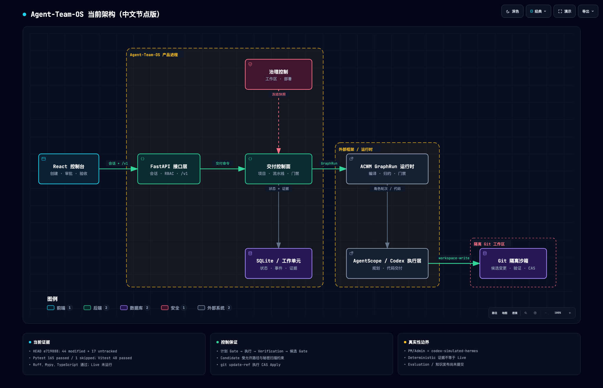
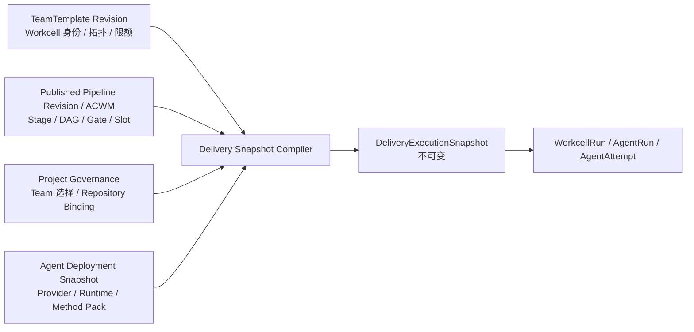
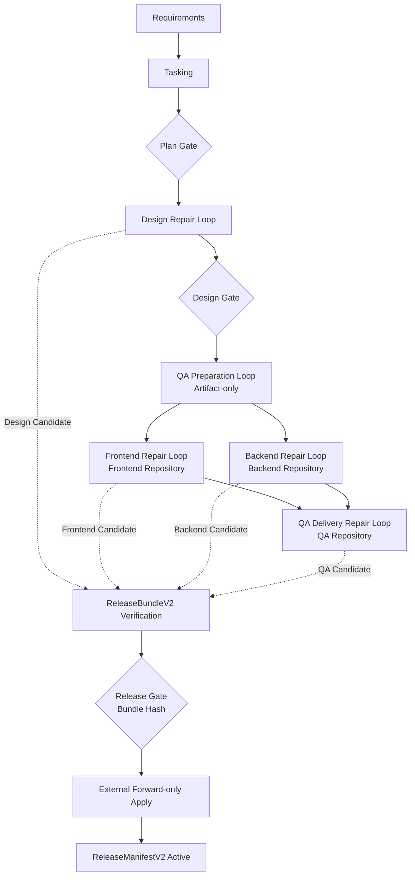
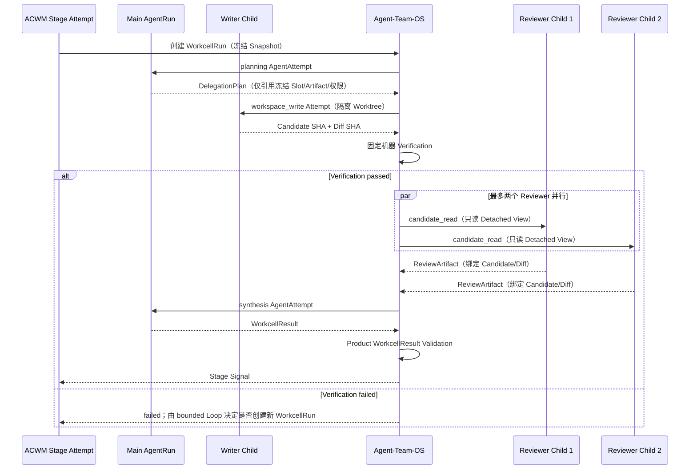
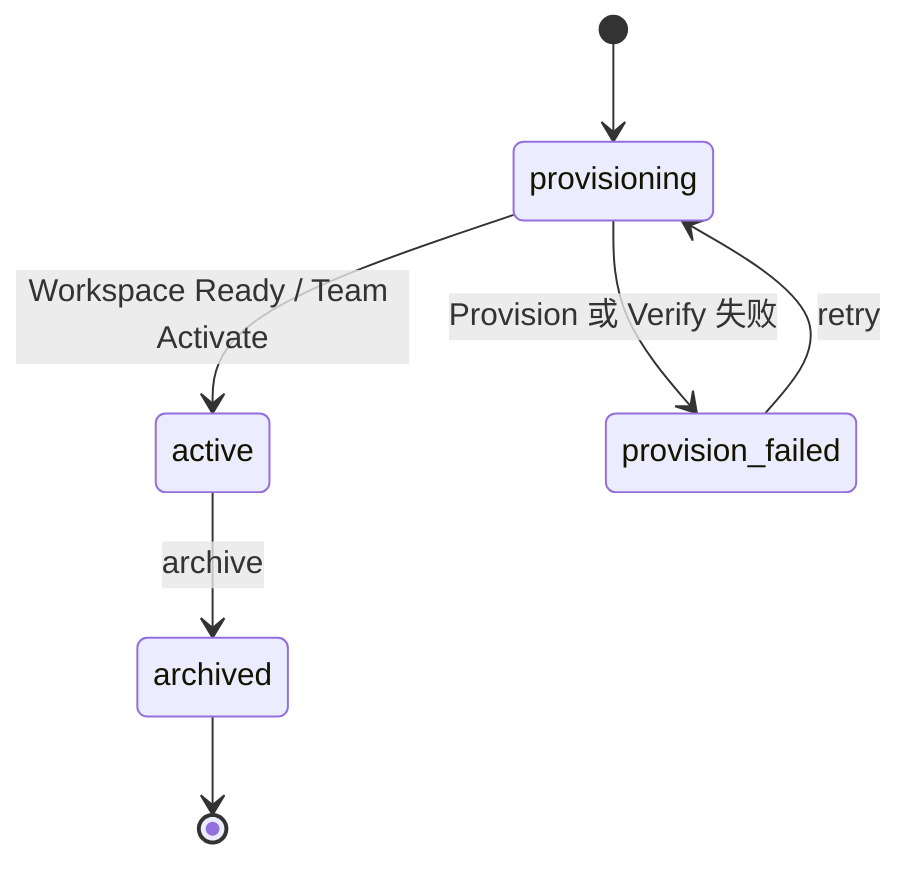
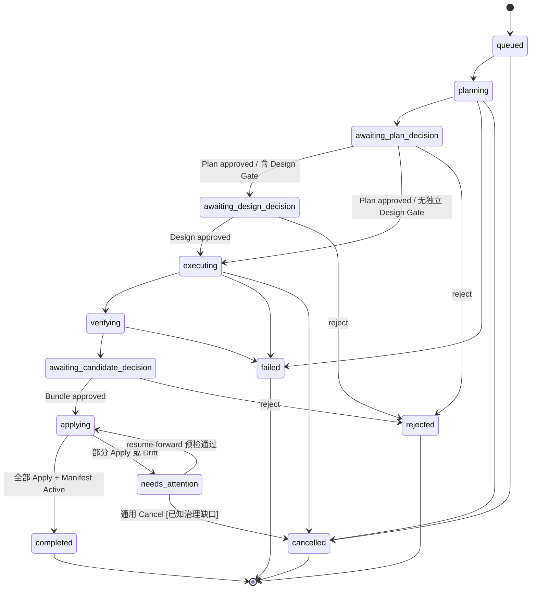
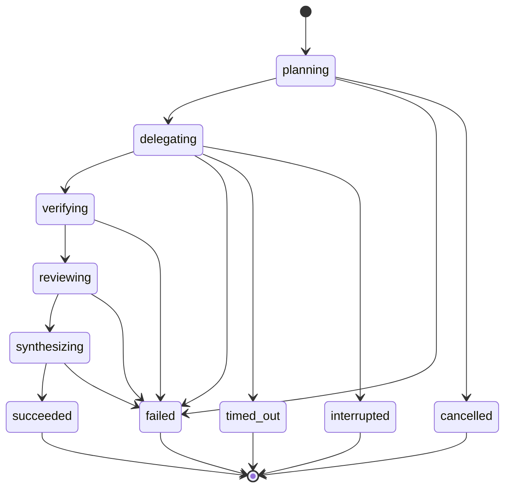
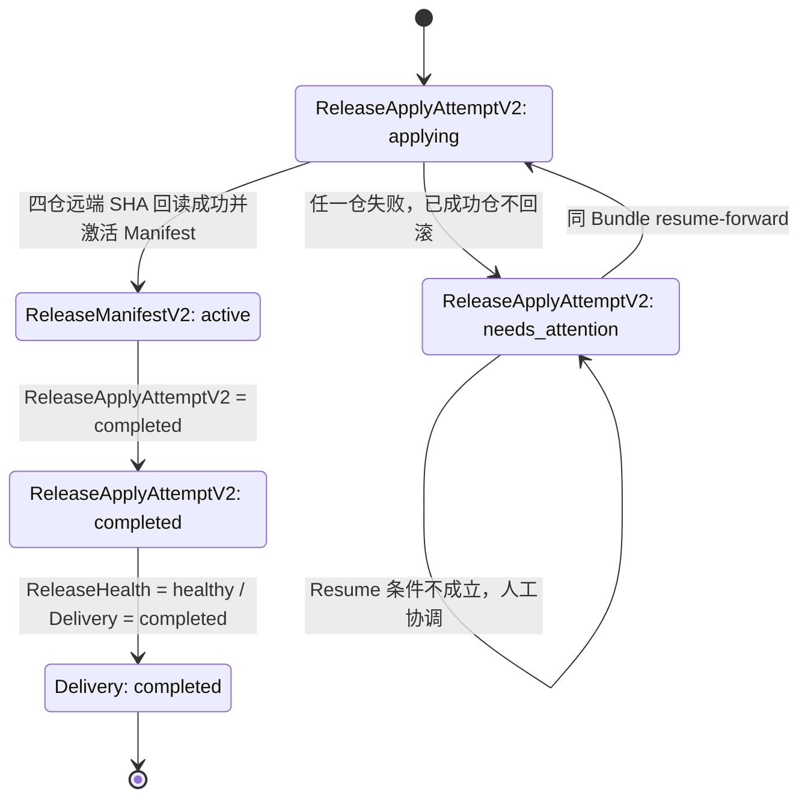

# Agent-Team-OS v0.5.0 产品事实总纲

> 面向产品、架构、研发、测试与交付运营人员的统一产品说明。本文解释“产品是什么、为什么存在、
> 如何工作、当前真正做到什么”，不替代 OpenAPI、领域模型、Migration 或 ADR。

## 0. 文档元数据与阅读规则

| 字段 | 值 |
|---|---|
| 产品版本 | `0.5.0` |
| 产品阶段 | 本地 Alpha；尚未完成正式 Release 验收 |
| 文档版本 | `1.0` |
| 文档日期 | 2026-09-01 |
| 事实基线 | `codex/v050-agent-workcell-kernel@17eea23a0529d3190770d853ded4abd28c7a63ec` |
| `main` 对照 | `main@1bfe3ff5e034e1a9cd3048b7b6300889ec7b02af` |
| 合并状态 | 本文所述 v0.5.0 Workcell 代码位于功能分支，**尚未合入 `main`** |
| ACWM 锁定版本 | `agent-capability-workflow-matrix==0.5.0`，Revision `65acf7f6a11cbcbe58dda88e3a4aa3d48f87245d` |
| 控制台契约 | [`console/openapi.json`](../../console/openapi.json)，107 条 Path、132 个 HTTP Operation |

### 0.1 能力事实等级

本文对能力使用以下四种标签。没有标签的设计描述不能自动视为已验收能力。

| 标签 | 含义 |
|---|---|
| **[已实现]** | 当前 Git Revision 中存在领域模型、接口或控制台实现，并有相应代码/迁移依据。 |
| **[Deterministic 已验证]** | 在固定本地 Adapter、Fixture 或 Bare Git Remote 下验证了产品状态机与证据链；**不证明真实模型智能、真实 Provider 或生产 SLA**。 |
| **[Live blocked/not_run]** | Live 前置条件缺失或未通过，必须记为阻塞/未运行，不能换算成通过。 |
| **[未来规划]** | 当前版本不存在；仅声明边界或进入下一版的条件。 |

标注可以出现在段落、表格或覆盖整个功能域的成熟度总表中。第 2–9 章既包含当前实现，也包含其规范性
不变量；“应该如何工作”不自动等于“已经通过 Live 验收”。具体实现等级以第 5.1 节成熟度总表为准，
验证强度与证据缺口以第 10 章为准。

### 0.2 事实来源优先级

当材料不一致时，按以下顺序裁决：

1. 当前 Revision 的领域代码、Migration、配置锁和生成契约；
2. 绑定同一 Revision 的自动化测试、浏览器证据和 Release Report；
3. 已接受 ADR；
4. Release Note、README 与设计说明；
5. Roadmap、讨论记录和界面文案。

因此，历史文档中的 `66 passed`、旧测试总数或“工作树开发证据”不会覆盖本文基线下重新执行的
`21 files / 69 tests passed`。同理，界面显示“Ready”不等于 Live Release 已验收。

### 0.3 本文不取代的权威材料

- 请求、响应与 Console Client Schema：[`console/openapi.json`](../../console/openapi.json)；
- 领域不变量：[`src/agent_team_os/`](../../src/agent_team_os/)；
- 数据演进：[`migrations/`](../../migrations/)；
- 架构决策：[`docs/architecture/`](../architecture/)；
- v0.5 交付边界：[`V0.5.0-AGENT-WORKCELL-KERNEL.md`](../releases/V0.5.0-AGENT-WORKCELL-KERNEL.md)；
- ACWM 与 Method Pack 锁：[`framework-lock.json`](../../config/framework-lock.json) 与
  [`method-packs-v050.json`](../../config/method-packs-v050.json)。

---

## 1. 产品定义

### 1.1 一句话定位

**Agent-Team-OS 是把多个 Agent 的工作组织成可验证、可审批、可恢复的软件交付的控制平面；
它不是多 Agent 聊天界面，也不是另一个 Agent Runtime。**

一个具体例子：同一次“新增健康检查能力”的 Delivery 中，Design、Frontend、Backend、QA 分别在
四个独立 Git Repository 中工作。系统冻结每个角色的 Workspace、Provider、Method 与权限；Writer
产生 Candidate 后先运行机器验证，再让 Reviewer 读取同一 SHA 的只读 Candidate。四仓都形成已验证
Candidate 后，用户批准一个不可变 `ReleaseBundleV2`；系统逐仓 Fast-forward `main`，回读远端 SHA，
最后才激活 `ReleaseManifestV2`。

这里的核心产品价值不是“Agent 会写代码”，而是：

- 谁可以在什么仓库做什么是冻结且可审计的；
- 模型自述不能替代真实机器验证；
- Reviewer 审查的 SHA 与最终 Apply 的 SHA 必须相同；
- 人工 Gate 的 Subject Hash 不能被静默替换；
- 部分发布不会被伪装成成功，也不会用 Force Push 自动回滚；
- 重启、取消、超时和中断有持久化语义。

### 1.2 要解决的问题

| 问题 | Agent-Team-OS 的控制 |
|---|---|
| 角色 Agent 各自拥有独立代码仓库，无法靠共享目录自然协作 | `ProjectWorkcellBinding` + 每 Workcell 一个 Primary Repository + 内容寻址 Artifact |
| Agent 内部派生不透明，无法知道谁实际执行、何时取消或超时 | 产品可见 `WorkcellRun`、`AgentRun`、`AgentAttempt` 与父子关系 |
| 计划、Provider 或方法在执行中漂移 | Published Revision + `DeliveryExecutionSnapshot` |
| Agent 声称测试通过但没有可复核事实 | 产品执行固定 Verification，保存退出码、报告与哈希 |
| Reviewer 看到了旧 Diff，发布却应用了新 SHA | `ReviewArtifact` 绑定 Candidate SHA、Diff SHA 与 Reviewer Binding Hash |
| 多仓部分 Apply 后回滚会破坏外部仓库历史 | Forward-only Apply、`needs_attention`、`release_drifted`、同 Bundle `resume-forward` |
| 聊天记录无法支撑审计 | 不可变 Evidence、Artifact、Receipt、Manifest 与事件历史 |

### 1.3 产品目标

v0.5.0 的目标是建立可复用的 `Agent Workcell Kernel`：

1. 把组织拓扑、跨 Stage 流程、项目仓库、Provider/Method 和 Release 权威拆成独立模型；
2. 支持 Design、Frontend、Backend、QA 四个独立 Repository 的一次完整 Delivery；
3. 让 Main、Child 和每次 Provider Attempt 都成为产品可观察实体；
4. 以机器验证、结构化 Review 和不可变 Hash 约束 Candidate；
5. 支持外部 GitHub HTTPS 仓库的非 Force Forward-only Apply 与部分发布恢复；
6. 保持 Legacy Managed Git V1 的历史语义与可读性。

### 1.4 非目标

v0.5.0 不承诺：

- 通用多 Agent 聊天、自由群聊或 BMAD Party Mode；
- 让 AgentScope 或 Hermes 取代产品的 Git、审批和 Release 状态机；
- 在一个共享 Git Workspace 中放入前端、后端、设计和 QA；
- 自动创建、删除或重命名用户远端仓库；
- 自动回滚已推进的外部 `main`、Force Push、自动 Rebase 或重写已审批 Bundle；
- 生产多租户、项目级 RBAC、生产 SLA 或官方模型 Benchmark；
- RAG 问答、Embedding、共享长期 Agent Memory；
- 支持仅允许 Provider-native PR Merge、禁止服务身份直推 `main` 的 Live 仓库。

### 1.5 适用与不适用场景

| 适用 | 不适用 |
|---|---|
| Coding Agent 团队需要受控、多仓交付闭环 | 只需要 Agent 聊天或 Prompt 编排 |
| 需要 DAG、bounded Loop、人工 Gate 和 Git 证据组合 | 必须马上获得托管生产服务、跨租户隔离或生产 SLA |
| 需要区分“产生、验证、审批、应用、激活”五类事实 | 仓库政策只允许 GitHub Merge，且不能授权服务身份直推 `main` |
| 研究 Agent Runtime 与产品控制面的职责边界 | 需要内置向量数据库、RAG 或长期共享 Memory |
| 本地 Alpha、架构验证和受控评测 | 直接接入敏感生产仓库；当前尚无独立安全审计 |

### 1.6 人物角色

| 角色 | 主要任务 | 典型责任边界 |
|---|---|---|
| **Administrator** | 初始化系统、管理用户/项目/Agent/Team/Pipeline/Settings、批准 Apply | 拥有全部产品权限；负责凭据引用、仓库策略与最终发布责任 |
| **Delivery Operator / Editor** | 创建 Delivery、编辑草稿、处理 Gate、取消 Workcell、维护 Wiki、运行评测 | 能推进日常交付，但不能管理用户、重置 Workspace、发布高权威 Revision 或 Apply Candidate |
| **Auditor / Viewer** | 按第 6.1 节列出的当前已认证 GET 范围读取控制面事实 | 不能改变运行状态；`/v1/users` 不可读，Wiki/Provider Knowledge 还受角色与资源规则过滤 |
| **Agent / Provider** | 在冻结 Slot 内规划、写入、产出 Artifact 或 Review | 不是产品用户角色；没有绕过机器验证、Gate 或 Apply 策略的权限 |

### 1.7 可验证成功指标

本版本不虚构商业用户量、生产可用性或模型质量。可接受的工程成功指标是：

- 四个 Release Participant 对应四个不同的 Repository URI，没有共享 Git Workspace；
- 每个 Workcell 有可查询的 Main、Child、Attempt、Method Hash 与 Workspace Access；
- 所有 Child 都来自 Published Pipeline 中预解析并冻结的 Slot；
- 每个最终 Candidate 都有通过的机器 Verification 和绑定同一 SHA 的 ReviewArtifact；
- Apply 前 `remote main == reviewed base`，Apply 后回读 SHA 等于 Candidate；
- 四仓 Receipt 全部成立后才激活 Manifest；目标不变量要求部分 Apply 保持非终态并按同 Bundle 恢复。
  当前通用 Cancel 能把 `needs_attention` 终结为 `cancelled`，这是尚未满足该指标的已知治理缺口，
  修复或增加阻断 Gate 前不得据此宣称 v0.5 已完成正式验收；
- Deterministic 与 Live 证据在报告和文档中始终分开；
- Release 验收必须在同一 Git Revision 上满足 `FAIL=0`、`WARN=0`、`skipped=0`，且同时具备浏览器、
  Deterministic 和 Live Gate。

---

## 2. 架构与唯一权威

### 2.1 当前架构图



图中每个角色 Workcell 的 Repository 是独立代码仓库实体。中央 Artifact Bus 传递内容寻址产物，
不是把仓库挂载到一个共享 Workspace。

### 2.2 权威边界

| 领域事实 | 唯一权威 | 明确不拥有的事实 |
|---|---|---|
| Stage、DAG、Gate、bounded Loop、Artifact Contract、Provider Binding | **Published Pipeline Revision / ACWM** | 不拥有真实仓库、用户权限或 Apply 决策 |
| Stage 内通信、角色组合与 Workcell Team Runtime | **AgentScope** | 不拥有跨 Stage Delivery 状态机 |
| PM / Project Admin 角色智能 | **Hermes 兼容实例** | 不拥有 Git、Verification、Approval 或 Manifest |
| 受控代码执行 | **Codex** | 不拥有产品状态和发布权威 |
| Workcell 身份、职责、拓扑、Workspace 要求、Delegation 上限 | **TeamTemplate Revision** | 不定义 Stage 顺序、Provider、凭据、真实仓库或 Release Participant |
| Team 选择、真实仓库和项目资源授权 | **Project Governance** | 不定义 Pipeline 语义 |
| Main/Child 调度、取消、超时、Attempt 和结果合成 | **Workcell Execution Module** | 不覆盖 ACWM 的 Loop/Gate，也不拥有 Git Apply |
| Candidate 校验、Approval、PR Receipt、Apply、Release Health、Manifest | **Agent-Team-OS Release Module** | GitHub PR 不是 Apply 权威 |
| BMAD/TEA 版本、内容、入口与资格 Hash | **Agent Deployment Extension Snapshot** | Method Pack 不定义 Pipeline 或 Git 权威 |
| 远端分支实际 SHA | **Git Remote** | UI 缓存或模型文本不能替代远端回读 |

### 2.3 从组织和项目编译到不可变执行快照



编译时必须同时满足：Team 中存在被 Pipeline 引用的 `workcell_key`；每个 `main` / `delegate_*`
Slot 有冻结的 `ResolvedProviderBinding`；项目为 Workcell 绑定了已验证 Workspace；Method Entry 已进入
资格快照；Release Contract 的每个 Workcell 能产生最终 Candidate。缺一项即 Fail Closed。

### 2.4 四仓完整交付 Journey



内置 `agent-workcell-delivery` 有 10 个顶层节点、10 条语义边。QA Preparation 只输出
`TestDesignArtifact`、`AtddArtifact` 等内容寻址产物，不产生 Git Candidate；QA Delivery 才形成 QA
仓库唯一 Candidate Lineage。Frontend 与 Backend 可以在同一 Delivery 内并行，但项目仍最多只有一个
活动 Delivery。

### 2.5 Workcell 内部时序



固定不变量：Child 深度最多 1；每个 Main 最多 3 个 Child、最多 2 个并发、最多 1 个 Writer；Main 的
planning 与 synthesis 是同一 Main `AgentRun` 下的两个 `AgentAttempt`；Child 不得继续派生；Main 不能
覆盖机器失败或 Blocking Review；跨 Child 只传 `ArtifactEnvelope`，不传原始 Session、Memory 或聊天历史。

### 2.6 状态机

#### Project



`archived` 项目可继续查询，但不能启动 Delivery、重置 Workspace 或修改资源绑定。

#### Delivery



Forward-only 设计把 `needs_attention` 定义为**非终态**：项目 Lease 应继续持有，Manifest 不激活。
但当前通用 Delivery Cancel 路径仍可令其进入 `cancelled` 并释放 Lease；这是图中显式标注的实现缺口，
不是合法的 Release 恢复语义。

#### WorkcellRun 与 AgentAttempt



`AgentAttempt` 的合法状态是 `running`、`succeeded`、`failed`、`cancelled`、`timed_out`、
`interrupted`；除 `running` 外均为终态。进程重启后不可恢复的 Codex Attempt 标记为
`interrupted`，不得伪装为恢复成功。

#### External Forward-only Release



对应 `ReleaseHealthV2`：正常时为 `healthy`；部分 Apply 时为 `release_drifted`；全部完成并激活 Manifest
后恢复为 `healthy`。v0.5 没有从 `needs_attention` 到自动回滚、Force Push 或新 Bundle 的边。

### 2.7 Legacy Managed Git V1 兼容路径

Legacy 项目仍使用受管 Bare Git 与 `RepositoryCandidate` / `ReleaseBundleV1` / 历史
`ReleaseManifest`。它采用 CAS 与 Compensation 语义，不应与 External Forward-only V2 混写：

| 维度 | Managed Git V1 | External Git / Workcell V2 |
|---|---|---|
| 仓库控制 | 产品管理本地 Bare Git | 用户预先创建的外部 GitHub HTTPS 仓库 |
| Candidate | `RepositoryCandidate` | `WorkspaceCandidateV2` |
| Bundle | `ReleaseBundleV1` | `ReleaseBundleV2` |
| Apply 失败 | CAS Compensation，保留历史语义 | Forward-only，进入 `needs_attention` |
| Manifest | 历史 Manifest | `ReleaseManifestV2` + 逐仓 `RemoteApplyReceipt` |
| 迁移 | 原模型保持可读 | 新模型从 Migration `0030` 起新增，不改写 `0001–0029` |

---

## 3. 核心概念与数据边界

### 3.1 TeamTemplate 与 Pipeline 不是同一张图

`TeamTemplateRevision` 只表达组织：动态 `workcell_key`、名称、职责、Primary Workspace 类型要求、
Delegate Purpose、Delegation 限额和展示拓扑。它明确禁止包含 Stage、执行顺序、Provider、Deployment、
Runtime Instance、Method 安装内容、Release Participant、真实仓库、路径或凭据。

Published Pipeline Revision 才定义 Stage、DAG、Gate、Loop、`workcell_stage_map`、
`release_contract_snapshot`、ACWM Workflow Manifest 与冻结 Provider Binding。控制台“组织模板”页面
不能编辑 Stage 顺序；“可视化编排”才是 Pipeline 语义入口。

### 3.2 四个 Repository 如何隔离

**[已实现] [Deterministic 已验证] [Live blocked/not_run]** 隔离机制已进入当前代码并在本地四仓门禁中
验证；外部 GitHub 四仓 Live 尚未运行。

每个 Workcell 只有一个可写 Primary Repository：

1. Writer 获得该 Workcell 的隔离可写 Git Worktree；
2. Candidate 固化后，Reviewer 只获得同仓 SHA 的只读 Detached View；
3. 其他 Workcell Repository 不挂载，也不通过 Codex `--add-dir` 伪装只读访问；
4. 跨 Workcell 输入只允许 `ArtifactAttachment`、Candidate/Diff Artifact、Provider Snapshot；
5. Artifact 以 SHA-256 内容寻址，接收方验证哈希后再使用；
6. 同一 Delivery 中 Frontend/Backend 可并行修改不同仓库，不产生共享 Git 锁冲突。

### 3.3 五类冻结事实

`DeliveryExecutionSnapshot` 把以下事实编译为不可变输入：

- TeamTemplate Revision 与组织 Hash；
- Pipeline Revision、Graph、Workcell Stage Map、Release Contract；
- 每个 Slot 的 Deployment、Provider Binding 与资格 Hash；
- 每个 Workcell 的 Workspace Binding、Base Revision 与验证 Hash；
- Method Pack Snapshot、Method Entry 与 Qualification Hash。

Delivery 不追随“最新 Revision”。修改 Team、Pipeline、Deployment、Workspace 或 Method Pack 只影响后续
Delivery；当前 Delivery 必须继续引用原 Snapshot，或显式失败后重建。

### 3.4 Candidate、Review、Bundle 与 Manifest

```text
Writer Commit
  -> Candidate SHA + Diff SHA
  -> CandidateVerification(passed)
  -> ReviewArtifact(same Candidate SHA + same Diff SHA)
  -> WorkspaceCandidateV2(verified)
  -> GitHubPRReceipt(open, base=main, head=Candidate Branch/SHA)
  -> ReleaseBundleV2(bundle_sha256)
  -> Human Gate(subject = bundle_sha256)
  -> RemoteApplyReceipt × 4
  -> ReleaseManifestV2(manifest_sha256, active)
```

任意 Hash、Base、PR Head、Verification 或 Review Binding 不一致都必须中止。PR 只提供 Review Surface；
产品 Gate 与远端 Fast-forward 才拥有 Apply 权威。

### 3.5 BMAD / TEA Method Overlay

**[已实现] [Deterministic 已验证]** v0.5 锁定：

| Package | Version | 允许入口 |
|---|---:|---|
| `bmad-method` | `6.11.0` | `bmad-ux`、`bmad-review`、`bmad-build`、`bmad-code-review` |
| `bmad-method-test-architecture-enterprise` | `1.23.4` | `bmad-testarch-test-design`、`bmad-testarch-atdd`、`bmad-testarch-automate`、`bmad-testarch-test-review`、`bmad-testarch-trace` |

系统校验 Registry Integrity、Archive SHA-256、内容 Hash、包身份、路径穿越、链接、重复路径、文件数、
大小和 Method Entry；不执行不受信任安装脚本。运行时从 Content-Addressed Store 构建临时只读
`CODEX_HOME` Overlay，结束后移除。业务仓库 Diff 不得出现 `_bmad`、`.agents/skills` 或安装产物。
Method 资格失败时必须阻塞，不得退回复制 Prompt。

---

## 4. 完整用户旅程

**成熟度：** 下述 Journey 与恢复状态机均 **[已实现]**，本地 Bare Remote 路径
**[Deterministic 已验证]**；真实 Hermes、Codex/GitHub 四仓闭环 **[Live blocked/not_run]**。

### 4.1 首次安装与系统初始化

1. 安装 Python `>=3.11,<3.13`、`uv`、Git、Node.js、pnpm `10.13.1`，以及 Live 执行需要的 Codex CLI。
2. 执行依赖安装、Method Pack 安装与 Overlay PoC（命令见第 9 章）。
3. 启动本地 Demo，浏览器打开 `http://127.0.0.1:8080`。
4. 全新数据目录创建第一个本地 Administrator；密码至少 12 位并包含字母和数字。
5. 在 Settings / Readiness 检查 ACWM、AgentScope、Git、Codex、Method Store 与 Credential Reference。

系统默认只监听 Loopback。当前是本地 Alpha，不能直接暴露到不可信网络。

### 4.2 建立四仓团队与项目

1. Administrator 在“组织模板”查看内置 `software-delivery-team:R1`，或创建、验证、发布新的
   TeamTemplate Revision。
2. 在“智能体实例”发布 Profile，配置 Deployment、Runtime Instance、Provider Manifest 与 Extension，
   执行 Qualification 并启用。
3. 在“可视化编排”查看 `agent-workcell-delivery:R1`，确认 Workcell Stage Map、四仓 Release Contract
   和所有 Slot Binding 已冻结。
4. 创建项目并选择 TeamTemplate Revision；新 Workcell 项目初始为 `provisioning`。
5. 分别为 Design、Frontend、Backend、QA 绑定四个**不同** Repository URI，提交间接 Credential
   Reference，逐仓 Verify。
6. 四仓与全部资源 Ready 后执行 Team Activate，项目进入 `active`。

Team Activate 会验证远端存在 `main`，并运行非 Force `git push --dry-run` 能力探针；探针失败时返回
`REMOTE_MAIN_APPLY_NOT_ALLOWED`，项目不能激活。当前探针把远端当前 SHA 原样 Dry Run 到 `main`，
并不执行真实 Ref 更新，也不查询 GitHub Repository Visibility。因此“私有仓库”和“服务身份将来一定
能推进受保护 `main`”仍需 Administrator 在 GitHub 侧核实；真正 Push 被拒时发布会进入
`needs_attention`，不能把 Dry Run Receipt 当作完整 Live 权限证明。

### 4.3 创建并运行 Delivery

1. Editor 或 Administrator 在项目“交付工作台”输入可验证目标，选择已发布 Pipeline。
2. 产品获取项目 Lease；同一项目已有活动 Delivery 时拒绝创建。
3. Snapshot Compiler 冻结 Team、Pipeline、Provider、Workspace、Method；缺失即失败，不启动 Agent。
4. Requirements 与 Tasking 形成结构化 Artifact，进入 Plan Gate。
5. 计划批准后执行 Design Workcell 与 Design Gate；拒绝则 Delivery 进入 `rejected`。
6. QA Preparation 输出测试设计与 ATDD Artifact；Frontend/Backend Workcell 随后并行。
7. QA Delivery 消费已验证 Artifact，不直接挂载前后端仓库，形成 QA Candidate。
8. UI 展示 Workcell Tree、每次 Attempt、运行身份、Method Hash、Candidate、Verification、Review 与 PR。

### 4.4 审批与 Forward-only Release

1. 产品确认 Design、Frontend、Backend、QA 四个最终 Candidate 都属于本次 Release Contract。
2. 每个 Candidate 必须有机器验证、绑定同一 SHA/Diff 的结构化 ReviewArtifact 和 Release-ready
   PR Receipt；该 Receipt 必须为 `open`，`base_branch == main`，Head Branch 等于 Candidate Branch，
   Head SHA 等于 Candidate SHA。`draft`、`closed`、`merged` 都可被观察，但不能进入 Bundle。
3. `ReleaseBundleV2` 固化四个 Candidate 并计算 `bundle_sha256`。
4. Administrator 审批的 Subject 是该 Bundle Hash，而不是可变 PR 页面。
5. 系统按冻结顺序逐仓重新 Fetch；要求远端 `main == reviewed base`。
6. 使用非 Force Fast-forward 把精确 Candidate 推进到 `main`；每仓 Push 后回读远端 SHA。
7. 四份 `RemoteApplyReceipt` 全部成立后激活 `ReleaseManifestV2`，Delivery 才进入 `completed`。

### 4.5 部分 Apply 的恢复

如果第 N 个仓库 Apply 失败：

1. 已成功仓库保持 Candidate，不回滚、不 Force Push；
2. 立即停止后续仓库；Delivery → `needs_attention`，Project Health → `release_drifted`；
3. Lease 不释放，Manifest 不激活；
4. Editor 可观察并上报 Drift；只有拥有 `delivery:candidate-apply` 的 Administrator 能修复凭据/项目治理
   前置条件并调用 `resume-forward`；
5. `resume-forward` 只复用原 Bundle，并检查：已应用仓仍为 Candidate，未应用仓仍为 Base；
6. 条件成立则从未完成位置继续；全部回读成功后激活 Manifest；
7. 任一条件不成立则保持人工协调。v0.5 不自动 Rebase、补偿提交或换 Bundle。

设计上的 Forward-only 恢复路径没有“放弃并自动清理 Drift”的终态。当前通用 Delivery Cancel API
仍接受包括 `needs_attention` 在内的非终态 Delivery：Cancel 会把 Delivery 置为 `cancelled` 并释放项目
Lease，但**不会**修复已部分推进的远端、清除 `release_drifted` 或激活 Manifest。这是当前实现与目标
治理边界之间的已知缺口；它不是 Release 恢复手段。远端未人工对齐前不应开始下一次发布。

### 4.6 审计、Evidence 与 Knowledge

Auditor 从 Delivery 详情和 Evidence 页面复核运行身份、Revision、Artifact Hash、Gate、Verification、PR、
Receipt 和 Manifest。Evidence 本体不可编辑，重新验证只追加新 Verification。需要形成可维护说明时，
用户可显式把已验证 Evidence 派生为 Wiki；派生记录保留来源 ID、Revision 与 SHA-256，但不会改变原始
Evidence 的不可变性。Viewer 的当前读取面并非由一项通配 Permission 定义，而是“全局身份认证 +
个别 Endpoint/Domain 二次授权”的组合；精确范围见第 6.1 节。这里的 Viewer 不是项目级授权模型，
因为 v0.5 尚无项目级 RBAC。

---

## 5. 信息架构与功能规格

### 5.1 页面边界与功能成熟度

| 层级 | 路由 | 页面职责 |
|---|---|---|
| 全局 | `/projects` | 项目目录、创建与治理入口 |
| 全局 | `/agents` | Agent Profile、Deployment、Runtime Instance、Provider 能力 |
| 全局 | `/teams` | TeamTemplate 组织拓扑与 Revision |
| 全局 | `/orchestration` | Pipeline / Journey、DAG、Gate、Loop 与发布 Revision |
| 全局 | `/settings` | Readiness、Release Gate、可调整运营参数 |
| 项目级 | `/projects/:projectId/overview` | 项目资源绑定、Workspace 与 Release Health 概览 |
| 项目级 | `/projects/:projectId/deliveries` | 创建 Delivery 与最近运行 |
| 项目级 | `/projects/:projectId/deliveries/:deliveryId` | Delivery、Workcell、Attempt、Evidence、PR、Apply 详情 |
| 项目级 | `/projects/:projectId/board` | 基于权威事件重建的交付看板 |
| 项目级 | `/projects/:projectId/knowledge` | 项目 Wiki、知识来源与派生内容 |
| 项目级 | `/projects/:projectId/evidence` | 当前项目不可变 Evidence 目录与验证历史 |

旧 `/deliveries`、`/board`、`/knowledge`、`/evidence` 路由只重定向到 `legacy-default` 项目。当前没有
独立 `/evaluation` 控制台页面。

| 功能域 | 当前成熟度 |
|---|---|
| Identity、Project、TeamTemplate、Agent Catalog、Pipeline、Delivery、Workcell、Board、Evidence、Knowledge、Settings | **[已实现]**；公共合同/组件/领域测试覆盖程度见第 10 章 |
| 四仓 Workcell、隔离 Workspace、ReleaseBundleV2、Forward-only、`resume-forward` | **[已实现] [Deterministic 已验证] [Live blocked/not_run]** |
| BMAD/TEA Content-Addressed Store 与 Overlay | **[已实现] [Deterministic 已验证]**；真实方法效果不在证明范围 |
| Evaluation Domain、CLI、Runtime Router、Dataset | **[已实现]**；Offline Fixture 可运行，Live 按前置条件决定 `blocked/not_run` |
| Evaluation Console 与 Console Client Contract | **[未来规划]**；当前不存在 `/evaluation`，Router 未进入 Console OpenAPI |
| 真实 Hermes PM/Admin | Adapter 可注册；发布级 Live 使用证据 **[Live blocked/not_run]** |

### 5.2 Identity 与本地访问控制

| 项目 | 规格 |
|---|---|
| 目的 | 保护本地控制面命令，区分 Administrator、Editor、Viewer。 |
| 前置条件 | 全新数据目录；首次 Bootstrap 后才能登录。 |
| 用户动作 | Bootstrap、Login、Logout；Administrator 管理用户状态和角色。 |
| 状态变化 | User 启用/禁用与 Version；Session 创建/撤销/过期。 |
| 输出证据 | Product Event、Problem Detail；Session 与 CSRF Token 不作为交付 Evidence。 |
| 权限 | `users:manage` 仅 Administrator；读取/命令再按模块权限校验。 |
| 失败恢复 | 弱密码、错误 Origin/CSRF、最后一个管理员禁用、Version 冲突均拒绝；刷新版本或由管理员修复。 |

### 5.3 项目治理与 Workspace 接入

| 项目 | 规格 |
|---|---|
| 目的 | 把一个项目绑定到已发布 Team、Pipeline、Deployment、Knowledge Source 与真实仓库。 |
| 前置条件 | Team/Pipeline/Deployment 已发布；外部仓库已存在；凭据以引用方式提供。 |
| 用户动作 | 创建/编辑/归档项目；配置 Pipeline、Deployment Access、Knowledge Source；绑定/Verify Workspace；Team Activate。 |
| 状态变化 | Project：`provisioning` → `active` / `provision_failed` → `archived`；Workspace：`provisioning` / `ready` / `failed`。 |
| 输出证据 | Workspace Verification Hash、Base SHA、绑定 Version、Team Activation 结果、Release Health。 |
| 权限 | `projects:manage`、`workspace:reset` 仅 Administrator。 |
| 失败恢复 | Retry Provision/Verify；Base 或权限变化后重新验证；已归档项目只读。 |

### 5.4 组织模板 TeamTemplate

| 项目 | 规格 |
|---|---|
| 目的 | 定义 Workcell 身份、职责、Workspace 类型、Delegate Purpose、资源上限与展示拓扑。 |
| 前置条件 | Administrator；动态 `workcell_key` 唯一，拓扑引用合法。 |
| 用户动作 | Create Draft、Patch、Validate、Publish、查询 Revision。 |
| 状态变化 | Draft Version 递增；Published Revision 不可变。 |
| 输出证据 | Definition Hash、Revision、Validation 状态与拓扑。 |
| 权限 | 当前 TeamTemplate 写命令属于 Administrator 管理面。 |
| 失败恢复 | 禁止 Stage、Provider、Credential、真实仓库和 Release Member 字段；修复 Draft 后重新 Validate。 |

### 5.5 智能体实例与 Provider

| 项目 | 规格 |
|---|---|
| 目的 | 分离可复用角色语义、可变运行环境和可信 Provider 能力。 |
| 前置条件 | Profile Revision 已发布；Runtime Instance 健康；Adapter/Provider Manifest 可用。 |
| 用户动作 | 编辑/发布 Profile；创建 Deployment/Instance；Health Check；Qualify、Enable/Disable；管理 Extension。 |
| 状态变化 | Draft → Validated → Published；Deployment Qualification 与 Enable 状态变化。 |
| 输出证据 | Profile/Deployment Snapshot、Provider Manifest、Runtime Identity、Qualification Hash、Extension Snapshot。 |
| 权限 | Editor 仅可编辑 Profile 草稿；Publish、Instance、Deployment、Extension 管理均为 Administrator。 |
| 失败恢复 | 版本/能力不兼容、凭据缺失或资格漂移时禁用绑定；修复后重新 Health Check/Qualify。 |

### 5.6 可视化编排

| 项目 | 规格 |
|---|---|
| 目的 | 编辑并发布跨 Stage 的 DAG、条件边、人工 Gate、bounded Loop 与 Workcell Slot。 |
| 前置条件 | 所有 Stage/边合法；Loop 有上限；Provider/Workcell/Method 绑定完整。 |
| 用户动作 | Create/Patch Draft、图校验、Publish、Activate、查看 Published Snapshot。 |
| 状态变化 | Draft Version 与 Validation；Published Revision 不可变；Activation 指向固定 Revision。 |
| 输出证据 | Graph Fingerprint、Revision Hash、ResolvedProviderBinding、Workcell Stage Map、Release Contract。 |
| 权限 | Editor 可编辑；Publish/Activate 需要 Administrator 的发布权限。 |
| 失败恢复 | 显示合同错误并修复 Draft；不得把 Schema 解析失败静默渲染成空图。 |

### 5.7 交付工作台与 Workcell 执行

| 项目 | 规格 |
|---|---|
| 目的 | 从一句目标进入可审批工程流程，并完整观察 Stage、Main、Child、Attempt 与 Artifact。 |
| 前置条件 | Project `active`；无其他活动 Delivery；固定 Pipeline 与资源均 Ready。 |
| 用户动作 | 创建 Delivery；审批/拒绝 Plan 与 Design；查看 Tree；取消 Delivery/Workcell。 |
| 状态变化 | Delivery 与 Workcell 状态机见第 2.6 节；取消向未完成 Child 传播。 |
| 输出证据 | Requirements、Task、Gate、Snapshot、Attempt、DelegationPlan、Verification、ReviewArtifact、WorkcellResult。 |
| 权限 | Editor 可创建、决定日常 Gate、取消 Workcell；最终 Candidate Apply 仅 Administrator。 |
| 失败恢复 | ACWM bounded Loop 创建新的 WorkcellRun；超时/中断保留真实终态，不在 Child 内递归。 |

### 5.8 交付看板

| 项目 | 规格 |
|---|---|
| 目的 | 把 Delivery/Stage/Gate 事实投影为可操作卡片，不创建第二套任务状态机。 |
| 前置条件 | 当前项目存在 Delivery/Event；过滤器命中。 |
| 用户动作 | 搜索、过滤、打开详情；拖动只表达合法命令。 |
| 状态变化 | 权威领域接受命令后重建投影；UI 不能直接改状态。 |
| 输出证据 | WorkItem 来源、合法命令、对应 Delivery/Event。 |
| 权限 | 命令沿用 Delivery 权限；Viewer 不能通过拖动写入。 |
| 失败恢复 | 非法拖动拒绝并刷新权威状态。`needs_attention` 的已知投影限制见第 11 章。 |

### 5.9 ReleaseBundleV2、PR 与 Forward-only Apply

| 项目 | 规格 |
|---|---|
| 目的 | 确保用户审查、批准与最终应用的是同一组四仓 Candidate。 |
| 前置条件 | 四个 Candidate verified；Review/SHA 匹配；PR 为 `open`、Base=`main`、Head Branch/SHA 精确匹配 Candidate；Release Gate 绑定 Bundle Hash。 |
| 用户动作 | 查看 PR/Receipt；Administrator 批准 Bundle；`needs_attention` 时 Resume Forward。 |
| 状态变化 | Apply Attempt：`applying` → `needs_attention` / `completed`；Health：`healthy` / `release_drifted`。 |
| 输出证据 | GitHubPRReceipt、ReleaseBundleV2、RemoteApplyReceipt、ReleaseManifestV2。 |
| 权限 | Candidate Apply 为 `delivery:candidate-apply`，仅 Administrator；Resume 走同一发布权威。 |
| 失败恢复 | 原 Bundle 预检后继续；不回滚、不 Force Push、不自动 Rebase、不使用 GitHub Merge。 |

### 5.10 Evidence

| 项目 | 规格 |
|---|---|
| 目的 | 保存不可变交付事实、完整性验证和重新验证历史。 |
| 前置条件 | Evidence 由受信产品流程产生或导入后具备来源身份。 |
| 用户动作 | 按项目/Delivery/类型检索；重新 Verify；跳转到来源。 |
| 状态变化 | Evidence 本体不变；Verification 只追加。 |
| 输出证据 | 内容 SHA-256、来源 Revision、验证状态与验证历史。 |
| 权限 | 三类用户可读；仅 Administrator 有 `evidence:verify`。 |
| 失败恢复 | Hash 或来源不匹配时标记失败，不覆盖历史；重新获取真实来源后再次 Verify。 |

### 5.11 Knowledge

| 项目 | 规格 |
|---|---|
| 目的 | 管理可编辑 Wiki、外部 Provider Snapshot 和从 Evidence 派生的可维护文档。 |
| 前置条件 | 项目存在；Provider Binding 已启用；派生来源可验证。 |
| 用户动作 | 创建 Space/Document、修订、恢复 Revision、评论、搜索、派生、重试 Publication。 |
| 状态变化 | Wiki Version/Revision；Provider Snapshot；Publication pending/published/failed。 |
| 输出证据 | Source ID、Revision、SHA-256、派生关系与 Publication 记录。 |
| 权限 | Editor/Administrator 可 `wiki:edit`；Viewer 不可编辑。 |
| 失败恢复 | 版本冲突刷新后重试；归档 Space 只读；Provider/Publication 修复后显式 Retry。 |

### 5.12 Settings 与 Readiness

| 项目 | 规格 |
|---|---|
| 目的 | 展示依赖与发布门禁，调整有限的本地运营参数。 |
| 前置条件 | 已登录；修改需要最新 Settings Version。 |
| 用户动作 | Refresh Readiness/Release Gate；以 CAS 保存 Planning/Execution/Verification Timeout 与 Evidence Retention 配置值。 |
| 状态变化 | Settings CAS Version；Readiness 为即时观察，不是持久能力声明。当前 Workcell Runtime 注入未从这些 Settings 动态解析命令或超时。 |
| 输出证据 | Dependency Check、Release Gate Report 引用、配置 Version。 |
| 权限 | `settings:edit` 仅 Administrator。 |
| 失败恢复 | Version 冲突刷新后重试；缺少依赖按 Repair 提示修复，不能在 UI 放宽安全硬限制。 |

### 5.13 Evaluation

| 项目 | 规格 |
|---|---|
| 目的 | 对固定 Pipeline/Revision、Dataset、Scorer 和 Runtime Identity 做可重复评测。 |
| 前置条件 | 版本化 Dataset 有合法 Manifest/Hash；Pipeline Baseline 可解析；Live 需要真实 Runtime。 |
| 用户动作 | CLI/API 创建、查看、取消 Run，读取 Case/Report，导入 Human Review。 |
| 状态变化 | Run 与 Case 状态；Report Gate 可能为 passed/failed/blocked/not_run。 |
| 输出证据 | Dataset Hash、Case Result、不可变 Report、Human Review 与 evaluation-report Evidence。 |
| 权限 | Editor/Administrator 可 `evaluation:run`、`evaluation:review`；Viewer 无此权限。 |
| 失败恢复 | Dataset/Report Hash 或 Baseline 不合法时失败；Live 条件缺失必须 `blocked/not_run`。 |

**当前边界：** Evaluation 有 Python Domain、运行时 Router、`agent-team-os-dev eval ...` CLI 与
`evaluation/datasets/agent-team-os-mvp/1.3.0` 数据集，但没有 `/evaluation` Console 页面。六个
Evaluation Router Operation 当前也没有被 `scripts/export_openapi.py` 注入
[`console/openapi.json`](../../console/openapi.json)，因此不属于生成的 Console Client 契约；其 Schema
权威暂时是 [`modules/evaluation/http.py`](../../src/agent_team_os/modules/evaluation/http.py) 与 Domain 代码。

---

## 6. 权限矩阵

权限是控制面全局角色权限，尚未细化为项目级 RBAC。表中“是”表示该角色拥有对应命令权限；读取接口
仍可能要求已登录、资源存在并满足项目边界。

| Permission | Administrator | Editor | Viewer | 作用 |
|---|:---:|:---:|:---:|---|
| `projects:manage` | 是 | — | — | 创建、编辑、归档项目与资源绑定 |
| `delivery:create` | 是 | 是 | — | 创建 Delivery |
| `workcell:cancel` | 是 | 是 | — | 取消 WorkcellRun |
| `delivery:plan-decide` | 是 | 是 | — | Plan/Design 等交付 Gate 决策 |
| `delivery:candidate-apply` | 是 | — | — | 批准 Candidate / ReleaseBundle 并触发 Apply |
| `journey:publish` | 是 | — | — | 发布 Journey/Pipeline Revision |
| `journey:edit` | 是 | 是 | — | 编辑 Journey/Pipeline Draft |
| `agents:manage` | 是 | — | — | Agent Catalog 管理 |
| `agent-profile:edit` | 是 | 是 | — | 编辑 Agent Profile Draft |
| `agent-profile:publish` | 是 | — | — | 发布 Agent Profile Revision |
| `agent-instance:manage` | 是 | — | — | 管理 Runtime Instance 与健康检查 |
| `agent-deployment:manage` | 是 | — | — | 管理 Deployment、Qualification 与启停 |
| `runtime-extension:manage` | 是 | — | — | 管理 Runtime Extension / Method Snapshot |
| `capability:edit` | 是 | 是 | — | 编辑 Capability Binding |
| `capability:publish` | 是 | — | — | 发布 Capability Binding |
| `evidence:verify` | 是 | — | — | 对 Evidence 追加重新验证结果 |
| `evidence:read` | 是 | 是 | 是 | 读取 Evidence 与验证历史 |
| `wiki:edit` | 是 | 是 | — | 创建、修订、恢复、评论 Wiki |
| `settings:edit` | 是 | — | — | 修改可调整运营参数 |
| `users:manage` | 是 | — | — | 创建、修改、启停用户与角色 |
| `workspace:reset` | 是 | — | — | 重置受管 Workspace |
| `evaluation:run` | 是 | 是 | — | 创建、取消 Evaluation Run |
| `evaluation:review` | 是 | 是 | — | 导入 Human Review |

安全含义：Editor 可以推进日常交付和修订草稿，但不能自行发布高权威 Revision、管理凭据/运行实例、
重置 Workspace 或最终 Apply。Viewer 没有任何写权限；`evidence:read` 是权限枚举中唯一显式命名的
只读 Grant，不能据此推导项目级隔离，因为该能力尚未实现。

### 6.1 Viewer 读取面（当前实现）

当前代码没有统一的 `read:*` Permission。`identity_guard` 对除公开路径外的所有 `/v1/*` GET、HEAD、
OPTIONS 先校验会话；各 Endpoint 或 Domain Service 再决定是否增加限制。因此 Viewer 的实际读取面是：

| 类别 | Viewer 结果 | 当前路径或范围 |
|---|---|---|
| 公开健康与初始化状态 | 无需登录即可读 | `GET /v1/readiness`、`GET /v1/auth/bootstrap-status` |
| 当前身份 | 登录后可读自己的 Session | `GET /v1/auth/session` |
| 标准控制面观察接口 | 登录后可读 | `projects`、Agent Profile/Deployment/Manifest、TeamTemplate、Project Workcell、WorkcellRun/Attempt、Release Health/Attempt、Delivery/AgentRun/PipelineRun/Event、Settings、Pipeline/Journey/Capability、Runtime Adapter/Instance、Board、Evidence、Release Gate 这些 GET/stream 路径 |
| Legacy Knowledge Read Model | 登录后可读 | `/v1/knowledge/documents*`、`/v1/knowledge/activity`、`/v1/knowledge/search`；属于旧读模型，不等于 Wiki ACL |
| Wiki | 按资源过滤后可读 | `/v1/wiki/*` GET；Viewer 的角色上限为 `READ`，显式 Space/Document Grant 还可把结果降为不可见；`include_archived=true` 仅 Administrator |
| Provider Knowledge | 通常不可直接列举，节点读取还依赖外部身份映射 | 运行时挂载时，`GET /v1/knowledge/provider-bindings` 仅 Administrator；`.../{binding_id}/nodes` 还需 Provider Actor 解析成功。这两条当前不在 Console OpenAPI 导出中 |
| Evaluation | 登录后可读既有 Run 结果 | 运行时挂载时的 Run、Cases、Report 三个 GET；当前不在 Console OpenAPI，也没有 `/evaluation` 页面 |
| 用户目录 | 拒绝 | `GET /v1/users` 在 `IdentityService` 内再次要求 `users:manage`，Viewer 无此权限 |

这张表描述的是当前全局角色实现，不承诺项目级数据隔离：除 Wiki/Provider 的资源规则外，Viewer 登录后
可观察多个项目的上述控制面 GET。新增 GET Endpoint 时必须重新审查，不能从“HTTP 方法是 GET”自动推导
其 Viewer 可见性。

---

## 7. 接口与数据契约

### 7.1 契约原则

- 本文不复制 Pydantic / OpenAPI 请求 Schema，避免文档与代码双重权威；
- Console 使用的公共契约以 [`console/openapi.json`](../../console/openapi.json) 为准；
- 生成的 TypeScript 类型位于
  [`console/src/shared/api/generated/schema.ts`](../../console/src/shared/api/generated/schema.ts)；
- HTTP 错误使用 `application/problem+json`，核心字段为 `code`、`title`、`detail`、`repair`、
  `trace_id`，版本冲突可附 `expected_version` / `actual_version`；
- 写命令普遍使用乐观版本/CAS；遇到冲突应刷新权威对象，而不是覆盖提交；
- Evaluation Router 当前未进入 Console OpenAPI，见第 5.13 节。

### 7.2 关键实体契约

| 实体 | 身份与不可变量 | 主要引用 |
|---|---|---|
| `TeamTemplateRevision` | Revision 与 Definition Hash 不可变 | Workcell Definition、Topology、DelegationPolicy |
| `PipelineRevision` | Graph、Fingerprint、Provider Binding、Workcell Map、Release Contract 不可变 | ACWM Workflow Manifest |
| `ProjectWorkcellBinding` | 项目中的 Workcell Slot 到 Workspace Binding | Team Revision、Workspace Verification |
| `DeliveryExecutionSnapshot` | 同一次 Delivery 的 Team/Pipeline/Provider/Workspace/Method 冻结结果 | WorkcellRun、Release Contract |
| `WorkcellRun` | 一个 ACWM Stage Attempt + Loop Iteration | Workcell Snapshot、Main AgentRun |
| `AgentRun` | 逻辑 Main/Child、父根关系、Depth、Purpose、Workspace Access | 多个 AgentAttempt |
| `AgentAttempt` | 一次 Provider 调用、Phase、Binding Hash、Runtime Identity、真实终态 | 结果 Artifact |
| `ReviewArtifact` | Candidate SHA、Diff SHA、Reviewer Binding Hash、Blocking Findings | 内容寻址 Artifact Reference |
| `WorkspaceCandidateV2` | Base/Candidate/Diff/Verification/Review/Branch 全部一致 | PR Receipt、ReleaseBundleV2 |
| `ReleaseBundleV2` | Release Contract 顺序与 Candidate 集合的 Hash | Gate Subject、Apply Attempt |
| `RemoteApplyReceipt` | Before/Candidate/After SHA 与应用顺序 | ReleaseManifestV2 |
| `ReleaseManifestV2` | 四仓 Receipt、Bundle、Pipeline 的最终激活 Hash | Project Release Health |

### 7.3 并发与终态规则

- v0.5 每 Project 最多一个活动 Delivery；Forward-only 正常恢复路径会在 `needs_attention` 时继续持有
  Lease，但当前通用 Cancel 可把它置为 `cancelled` 并释放 Lease，属于已知治理例外；
- 同一 Delivery 内 Frontend、Backend Workcell 可并行，不同 Repository 的 Git 修改可并行；
- 每 Workcell 最多两个 Child 并发，但只能有一个 `workspace_write` Writer；
- Delivery 终态：`completed`、`rejected`、`failed`、`cancelled`；
- WorkcellRun 终态：`succeeded`、`failed`、`cancelled`、`timed_out`、`interrupted`；
- AgentAttempt 除 `running` 外均为终态；
- Release Apply 的 `needs_attention` 与 Project Health 的 `release_drifted` 都不是“发布失败后已结束”，
  而是继续占用治理责任的人工协调状态；
- `ReleaseManifestV2.status` 只有 `active`，因为未完成的发布不能创建一个“未激活 Manifest”冒充结果。

---

## 8. 安全与信任边界

**成熟度：** 下列机制均有 **[已实现]** 代码边界；Workspace、Secret Scan 与 Method Overlay 有
**[Deterministic 已验证]** 证据，但产品尚未经过独立安全审计，不能据此宣称生产安全等级。

### 8.1 身份与 Web 安全

- Demo 默认监听 `127.0.0.1`；
- 密码使用 `scrypt` 派生哈希；Session Bearer 与 CSRF Token 只存 Hash；
- 所有变更命令校验同源 `Origin` 与 CSRF Header；
- Session 支持过期和撤销；不能禁用最后一个 Administrator；
- 当前没有多租户和项目级 RBAC，也没有独立安全审计，因此不能直接面向不可信网络。

### 8.2 凭据边界

- External Git 只接受 `env://NAME` 或 `keychain://service/account`；
- Agent/Knowledge Provider 使用各自领域验证的 `env:NAME` 或 `keychain:...` 引用格式；
- 数据库、API、日志、截图、Fixture、Gate Report 和 Git 只应保存引用，不保存秘密值；
- Git Credential 在子进程环境中临时解析；缺失时 Fail Closed；
- 本地评测账号密码必须由会话环境注入，不得写入本文、仓库、日志或截图。

### 8.3 Workspace 与代码安全

- Writer 使用隔离 Worktree，执行后重新读取真实 Git Diff；
- 修改路径必须匹配产品策略。当前 Workcell Runtime 的固定路径策略是：Design `design/**` + `tests/**`，
  Frontend/Backend `src/**` + `tests/**`，QA `tests/**` + `reports/**`；未知 Workcell 回退到
  `src/**` + `tests/**`。因此 Design 若要写 `docs/**` 或其他资产必须先通过产品代码发布新策略，不能在
  Agent Prompt 中自行放宽；
- Empty Candidate、越界路径、秘密模式、非法 Artifact、Verification 失败均在人工审批前拒绝；
- Reviewer 目录在 Candidate 固化后设为只读，不提供其他仓库挂载；
- External Git 只允许非 Force Push，Candidate Branch 为
  `agent-team-os/{delivery_id}/{workcell_key}`；
- Apply 前后都从远端读取 SHA，不能以本地引用或 PR 文案代替。

### 8.4 数据、Artifact 与数据库

- SQLite Migration 启用 Foreign Key、`journal_mode=WAL` 与 5 秒 Busy Timeout；
- Migration 带 Checksum，不能通过修改历史 Migration 强迫旧数据库启动；
- Product Event 与 Evidence 提供只追加审计基础，重新验证不覆盖历史；
- Artifact、Method Pack、Snapshot、Verification、Review、Bundle、Receipt、Manifest 使用 SHA-256
  内容/结构寻址；
- 内容寻址证明“字节/结构未变”，不自动证明来源可信或业务正确；来源身份与验证状态仍需单独检查；
- 默认数据目录 `.agent-team-os/` 包含 SQLite、Artifact、Method Store 和工作目录，不应提交 Git。

### 8.5 Method Pack 供应链边界

- 使用锁定 npm Tarball、Registry Integrity、Archive SHA-256、Content Hash 与 Qualification Hash；
- 拒绝路径穿越、绝对路径、符号/硬链接、重复文件、包身份不符、数量/大小超限；
- 不运行安装脚本，不把 Method 文件复制到业务仓库；
- Runtime Overlay 只读且临时，Party Mode 不在允许入口中；
- Lock、Store、Delivery Snapshot 或 Workspace Diff 任一漂移都 Fail Closed。

---

## 9. 安装、启动与运维

**成熟度：** 本地源码启动、Readiness、开发检查和恢复入口 **[已实现]**；四仓 GitHub 运维前置条件
仍为 **[Live blocked/not_run]**。

### 9.1 环境要求

- Python `>=3.11,<3.13`；
- `uv`；
- Git；
- Node.js 与 pnpm `10.13.1`；
- Live Codex Workcell 需要已安装并登录 Codex CLI；
- Live External Release 需要四个已存在的私有 GitHub HTTPS 仓库和允许服务身份直推 `main` 的权限。

### 9.2 从源码首次启动

```bash
uv sync --extra dev --extra live
pnpm --dir console install --frozen-lockfile

.venv/bin/python scripts/install_method_packs.py
.venv/bin/python scripts/poc_method_pack_overlay.py

pnpm --dir console build
uv run --extra live agent-team-os demo
```

打开 <http://127.0.0.1:8080>。使用独立临时数据目录时：

```bash
AGENT_TEAM_OS_DATA_DIR=/tmp/agent-team-os-demo \
  uv run --extra live agent-team-os demo
```

不要把真实评测密码写进 Shell History、文档或脚本。门禁账号通过
`AGENT_TEAM_OS_TEST_PASSWORD` 在当前会话环境注入。

### 9.3 Readiness 清单

启动后至少核对：

1. 数据库 Migration 成功且没有 Checksum Drift；
2. ACWM 版本/Revision 与 `config/framework-lock.json` 一致；
3. AgentScope Runtime/Adapter 可用；
4. Codex CLI 登录与受控执行可用（Live 时）；
5. `method-packs:bmad-tea-v050` Store、Entry 和资格 Hash 一致；
6. 四个 Workspace 各自 Verify，Repository URI 互不重复；
7. GitHub Credential Reference 可解析但不暴露值；
8. 每仓能力 Receipt 至少证明 `main` 可读取、Transport/Credential 合法且 no-op Dry Run 未被拒绝；
   另由 Administrator 在 GitHub 侧确认 Repository 为私有、服务身份确有更新受保护 `main` 的权限；
9. Published Pipeline 的 Workcell Map、全部 Slot 和 Release Contract 完整；
10. 当前 Preview/Gate 为所有 Workcell 注入的机器验证命令是
    `python -m unittest discover -s tests -v`（当前 Python 解释器），超时由 Verifier 构造参数控制，
    默认 300 秒；确认目标四仓确实兼容该命令；
11. Release Gate 报告绑定当前 Git / ACWM / Pipeline Revision，且未过期、未损坏。

任一 Live 条件缺失时，状态只能是 `not_ready`、`blocked` 或 `not_run`，不能自动切换到
Deterministic Adapter 后宣布 Live Ready。

### 9.4 开发验证命令

```bash
uv run ruff check src tests scripts
uv run mypy src/agent_team_os
uv run pytest -q

pnpm --dir console typecheck
pnpm --dir console test
pnpm --dir console build
pnpm --dir console api:check
```

Method 与 Workcell 定向验证：

```bash
.venv/bin/python scripts/install_method_packs.py
.venv/bin/python scripts/poc_method_pack_overlay.py

.venv/bin/python -m pytest -q \
  tests/test_workcell_execution_kernel.py \
  tests/test_workcell_pipeline_e2e.py \
  tests/test_external_forward_release_v2.py
```

浏览器门禁必须由独立 Gate 数据目录和会话级密码运行；`scripts/browser_workcell_e2e.py --help`
给出驱动参数。四个本地 Bare Remote 只证明 Deterministic Git/状态机，不证明 Live Provider。

### 9.5 Evaluation CLI

```bash
uv run agent-team-os-dev eval validate-dataset
uv run agent-team-os-dev eval run --mode offline --profile standard
uv run agent-team-os-dev eval inspect <run_id>
uv run agent-team-os-dev eval report <run_id>
uv run agent-team-os-dev eval cancel <run_id>
```

Fixture Bootstrap 必须使用非默认、显式的 `AGENT_TEAM_OS_DATA_DIR`。`--require-gate-passed` 只验证该
Evaluation Report 的 Gate，不替代版本级 Live Release Report。

### 9.6 故障恢复 Runbook

| 现象 | 先确认 | 恢复动作 | 禁止动作 |
|---|---|---|---|
| Migration Checksum Error | 数据库与 Migration 历史是否匹配 | 使用匹配版本启动；恢复完整备份；必要时编写新 Migration | 修改旧 Migration Checksum 强制通过 |
| Workcell 长期 `running` 后进程重启 | AgentAttempt/子进程是否仍存在 | 启动恢复逻辑，将不可恢复 Attempt 标为 `interrupted`，由 ACWM Loop 重试 | 手工改为 `succeeded` |
| Verification Failed | Candidate SHA、命令、日志 Hash | 修复后由 bounded Loop 创建新 WorkcellRun/Candidate | Main 覆盖失败或复用旧 Review |
| Blocking Review | Finding、Evidence SHA、Candidate/Diff | 修复后生成同一 Lineage 的新提交并重新验证/评审 | 删除 Finding 或直接 Apply |
| Base Drift | 远端 `main` 与 Reviewed Base | 停止 Apply；从当前 HEAD 重建 Candidate、验证和审批 | Force Push、自动 Rebase、复用旧 Gate |
| Partial Apply | Receipt、各远端当前 SHA、原 Bundle | 满足 Resume 条件时执行 `resume-forward`；否则人工协调 | 回滚已成功仓、换 Bundle 继续、GitHub Merge |
| Method Store Drift | Lock、Archive、Content、Entry、Qualification Hash | 重新获取锁定包并重做 Overlay PoC | 复制 Prompt 或把 Method 安装进业务仓库 |
| Credential Missing | 引用格式、环境/Keychain 项是否存在 | 在会话环境或 Keychain 修复引用并重新 Verify | 写入 SQLite、日志、Fixture 或 Git |
| Empty Pipeline Graph | Definition Schema 与 `workflow_mode`/Slot | 显示校验错误，修复 Schema/Definition 后重新解析 | 静默降级为 `nodes: []`、`edges: []` |

### 9.7 本地数据与备份

产品当前没有内置在线备份/恢复向导。需要备份时先停止服务，完整保存数据目录中的 SQLite 数据库、
WAL/SHM（如存在）、Artifact Store、Method Store 和必要工作区元数据；恢复时使用同一代码/Migration
版本并先在副本验证。凭据实际值不在数据目录中，环境变量/Keychain 需单独恢复。

---

## 10. 当前验证证据与成熟度

### 10.1 2026-09-01、Revision `17eea23` 开发验证快照

| 检查 | 结果 | 能证明什么 | 不能证明什么 |
|---|---:|---|---|
| Ruff | 通过 | 当前 Python 源码满足配置的静态规则 | 运行行为正确 |
| strict Mypy | 通过，146 个 Source File | 当前领域包类型检查通过 | 外部系统可用 |
| Pytest | `210 passed / 1 skipped` | 单元、合同、集成与本地状态机回归 | 被跳过的真实 Codex 探针、Live Provider |
| 跳过项 | `tests/integration/test_live_codex_simulated_planning.py` | 只有设置 `AGENT_TEAM_OS_LIVE_CODEX=1` 才显式运行 | 不能把 Skip 当 Pass |
| Vitest | `21 files / 69 tests passed` | 当前 React 组件、控制器与关键 Workcell UI 语义 | 全浏览器视觉质量、生产兼容性 |
| TypeScript Typecheck | 通过 | Console 静态类型一致 | HTTP Runtime 一定可用 |
| Vite Build | 通过，3529 Modules | Console 可产生生产构建产物 | 生产部署可用性 |
| OpenAPI Sync | 生成结果无漂移 | 107/132 Console Client 契约与生成类型一致 | Evaluation Router 已纳入 Console Contract |
| Deterministic 浏览器门禁 | 通过 | 内置图 10 节点/10 边、9 条 verified Evidence、重启恢复、`candidate_matches_main=true` | 真实模型质量和 GitHub Live 权限 |
| BMAD/TEA Overlay PoC | 通过 | 锁定归档、入口发现、只读 Overlay 与业务仓无污染 | 第三方方法的业务效果 |
| 四 Workcell Live Release | `blocked/not_run` | 准确暴露缺失的 Live 前置条件 | 不能声称 v0.5 Live 通过 |

这些结果是当前代码 Revision 的**开发验证快照**，不是正式 `Release Report`。文档修改本身不会把历史
开发验证升级为发布验收。正式验收仍要求同一 Agent-Team-OS Revision 下 Ruff、Mypy、Pytest、
TypeScript、Vitest、Build、OpenAPI Sync、浏览器、Deterministic Gate 与四 Workcell Live Gate 全部成立，
且最终报告 `FAIL=0`、`WARN=0`、`skipped=0`。

本快照来自当前工作树中的命令输出与浏览器门禁观察，仓库内没有一份同时绑定这些最新数字、Report
Hash 和 Evidence ID 的已提交不可变报告。因此它是可复查的开发记录，不是审计级证据入口；文档提交后
仍应在提交 SHA 上重新运行并生成正式 Report。

### 10.2 Runtime Identity 边界

| 路径 | 当前身份 | 成熟度结论 |
|---|---|---|
| 默认 Requirements / Tasking | `codex-simulated-hermes` | **[已实现]** 结构化规划 Adapter；不是 Hermes Live 证据 |
| Workcell Main / Child | `codex-cli` | **[已实现]** 受冻结 Slot/Workspace/Method 控制；Live 仍需凭据与实际门禁 |
| 本地四仓 E2E | `deterministic-test` | **[Deterministic 已验证]** 产品调度、Git 和证据链 |
| Hermes Adapter | `hermes-acp` / `hermes-http` | 可注册/健康检查；真实 PM/Admin 使用尚未形成发布证据 |
| 外部 GitHub 四仓 | GitHub HTTPS | **[Live blocked/not_run]** 缺四个评测仓库与直推 `main` 服务权限 |

### 10.3 不能从当前证据推出的结论

- 不能推出真实 Hermes 已参与交付；
- 不能推出 Codex/BMAD/TEA 的模型质量、成功率或成本；
- 不能推出官方 BFCL/GAIA 排名；Fixture Harness 不是官方 Benchmark；
- 不能推出生产用户规模、SLA、并发容量、安全等级或灾备能力；
- 不能推出所有页面已通过系统性视觉/可用性验收；Vitest 与一次浏览器闭环不是完整体验测试；
- 不能把 `blocked/not_run`、`skipped` 或缺失报告解释为通过。

---

## 11. 已知限制

### 11.1 产品与运行时

- v0.5 只实现 `git_repository_v1`；Document/Case/Ledger/Dataset Workspace Adapter 未实现；
- 每 Project 最多一个活动 Delivery；没有 Workspace-Set 跨 Delivery 并发 Lease；
- Child 深度固定为 1；每 Workcell 最多 3 个 Child、2 个并发、1 个 Writer；
- 默认规划身份是 `codex-simulated-hermes`，真实 Hermes PM/Admin 尚未通过版本门禁；
- Live 四仓需要外部凭据、四个私有 GitHub 仓库和直推 `main` 权限，当前为 `blocked/not_run`；
- External Git 只支持 GitHub HTTPS 与间接 Credential Reference，不管理 SSH Credential；
- “只接入已有私有仓库”是产品治理要求，但当前 Capability Probe 不调用 GitHub Visibility API；它也只对
  当前 `main` SHA 做 no-op `push --dry-run`，不能充分证明未来真实 Ref Update 一定绕过 Branch
  Protection。私有性与直推权限仍需外部核实，真实 Push 才是最终事实；
- 当前 Preview/Gate 的四个 Workcell 共用 Python `unittest` Verification Command；没有按仓库类型
  冻结独立的 Design/Frontend/Backend/QA Verification Profile。真实前端或非 Python 仓库若不兼容，
  必须视为 Live Readiness 缺口，不能把命令改写交给 Agent；
- Settings 中的 Timeout/Retention 值可 CAS 保存，但当前 Workcell Verifier、Planner/Executor 与
  Evidence 生命周期没有全部动态消费这些值；界面保存成功不等于运行策略已改变；
- 不支持 Provider-native PR Merge、自动 Rebase、自动补偿提交或外部 `main` 回滚；
- 没有项目级 RBAC、多租户、Embedding、RAG 回答生成或共享长期 Agent Memory；
- 没有发布安装包、Git Tag 或 GitHub Release；仓库当前没有 License。

### 11.2 控制台与体验

- Evaluation 有 API/CLI/数据集，但没有 `/evaluation` 页面；其 Router 也未进入 Console OpenAPI 导出；
- Board 没有独立 `needs_attention` 列。领域投影没有该显式映射时会走默认
  `failed-cancelled` 列，可能把“可恢复的部分 Apply”视觉上混同为失败/取消；Delivery 详情与
  Release Health 仍显示真实 `needs_attention` / `release_drifted`。这是已知展示限制，本次文档任务不修改代码；
- 通用 Delivery Cancel 当前可把 `needs_attention` 置为 `cancelled` 并释放 Lease，但不会清除
  `release_drifted` 或修复远端；项目治理尚未阻止操作者在这种 Drift 未协调时开始后续 Delivery。这是
  Forward-only 治理缺口，Cancel 不能被当作恢复成功；
- 当前前端自动化覆盖组件和关键闭环，但不能代替逐页布局、可访问性、不同视口、空/错/历史数据和
  长时运行的系统性体验验收；
- 本地评测数据与账号是会话/数据目录特定事实，不能把 Preview Fixture 当生产历史数据。

### 11.3 安全与运营

- 本地 Alpha 尚未经过独立安全审计；
- 只适合 Loopback 受控环境，不应直接暴露公网；
- SQLite/WAL 适合当前本地单实例目标，不代表生产级高可用数据库；
- 没有内置 Secret Manager、在线备份、跨节点恢复、审计导出或告警平台；
- Release Report 的 Live 条件未满足，因此 v0.5 不能宣称正式验收。

---

## 12. v0.6 边界与进入条件

**[未来规划]** v0.6 只保留已经明确后移的能力，不在本文展开新设计：

1. Workspace-Set 跨 Delivery Lease；
2. Delta ReleaseBundle、Manifest Version CAS 与并行 Manifest 合成；
3. Document / Case / Ledger / Dataset Workspace Adapter；
4. 二级子 Agent；
5. Provider-native PR Merge。

进入 v0.6 详细设计前至少满足：

- v0.5 的权威边界和四仓隔离不变量保持不变或有新 ADR 明确替代；
- v0.5 数据迁移、Legacy V1 和 Forward-only V2 回归稳定；
- 浏览器、Deterministic 与 Live Release Gate 能在同一 Revision 形成合格 Report；
- 每项新能力先定义唯一权威、并发/CAS、失败恢复、证据合同和迁移兼容；
- 不以增加并行度为由放松 Candidate SHA、Verification、Review 或 Gate 绑定。

Roadmap 是进入下一轮架构评审的边界，不是当前承诺或已实现能力。

---

## 附录 A：合法状态清单

| 聚合/实体 | 合法状态 | 终态 |
|---|---|---|
| Project | `provisioning`、`active`、`provision_failed`、`archived` | `archived` |
| Legacy ProjectWorkspace / ProjectRepository | `provisioning`、`ready`、`failed` | 不是业务终态；可重新 Provision |
| Workcell WorkspaceBinding | `pending`、`ready`、`failed` | 不是业务终态；可重新 Verify |
| ProjectTeamBinding | `provisioning`、`active`、`legacy_projected` | `active` / `legacy_projected` 是当前绑定的稳定状态，但项目归档后仍以 Project 为最终写边界 |
| Delivery | `queued`、`planning`、`awaiting_plan_decision`、`awaiting_design_decision`、`executing`、`verifying`、`awaiting_candidate_decision`、`applying`、`needs_attention`、`completed`、`rejected`、`failed`、`cancelled` | `completed`、`rejected`、`failed`、`cancelled` |
| WorkcellRun | `planning`、`delegating`、`verifying`、`reviewing`、`synthesizing`、`succeeded`、`failed`、`cancelled`、`timed_out`、`interrupted` | 后五项 |
| AgentAttempt | `running`、`succeeded`、`failed`、`cancelled`、`timed_out`、`interrupted` | 除 `running` 外 |
| CandidateVerification | `passed`、`failed` | 两者均为该次验证终态 |
| WorkcellResultValidation | `passed`、`failed` | 两者均为该次验证终态 |
| WorkspaceCandidateV2 | `verified` | `verified` |
| GitHub PR Receipt | `open`、`draft`、`closed`、`merged` | 远端观察值；只有精确绑定 Candidate 且状态为 `open` 才是 Release-ready，PR 本身不是 Apply 终态 |
| ReleaseBundleV2 | `verified` | `verified` |
| ReleaseApplyAttemptV2 | `applying`、`needs_attention`、`completed` | 仅 `completed`；`needs_attention` 可 Resume |
| ReleaseManifestV2 | `active` | `active` |
| ReleaseHealthV2 | `healthy`、`release_drifted` | 健康投影，不是一次性终态 |

## 附录 B：Console OpenAPI 分组索引

以下统计来自 `console/openapi.json`，总计 **107 Path / 132 Operation**。为避免复制 Schema，表中只给
领域索引与 Path Family；字段、状态码和 Body 以 OpenAPI 为准。

| 领域 | Path / Operation | Path Family 与主要动作 |
|---|---:|---|
| Identity | 7 / 8 | `/v1/auth/*`；`/v1/users*`：Bootstrap、Login、Session、Logout、用户管理 |
| Project | 15 / 20 | `/v1/projects*`；`/v1/workspaces/backend-demo/reset`：项目、仓库、资源授权、Team Activation、Release Health |
| Team | 6 / 8 | `/v1/team-templates*`；`/v1/team-template-drafts*`：Draft、Validate、Publish、Revision |
| Pipeline | 16 / 21 | `/v1/pipelines*`、`/v1/pipeline-drafts*`、`/v1/pipeline-runs*`、`/v1/journey*`、`/v1/capability-bindings*` |
| Agent | 19 / 24 | `/v1/agent-profiles*`、`/v1/agent-deployments*`、`/v1/agent-instances*`、`/v1/provider-manifests*`、`/v1/runtime-adapters` |
| Delivery | 15 / 16 | `/v1/deliveries*`、`/v1/board`、`/v1/work-items/*/command`、`/v1/events/stream` |
| Workcell | 4 / 4 | `/v1/workspace-bindings/*/verify`、`/v1/workcell-runs*` |
| Release | 4 / 4 | `/v1/releases*`、`/v1/release-gates*`：查询、Resume Forward、Gate History |
| Evidence | 3 / 3 | `/v1/evidence*`：列表、Verify、Verification History |
| Knowledge | 16 / 21 | `/v1/wiki*`、`/v1/knowledge*`：Space、Document、Revision、Comment、Search、Derivation、Publication |
| Settings | 2 / 3 | `/v1/readiness`、`/v1/settings` |
| Evaluation | 0 / 0 | 不在 Console OpenAPI；运行时 Router 另有 6 个 Operation |
| **合计** | **107 / 132** | 生成的 Console Client 契约 |

Evaluation 运行时 Router 的 6 个 Operation 是：

- `POST /v1/evaluation-runs`；
- `GET /v1/evaluation-runs/{run_id}`；
- `GET /v1/evaluation-runs/{run_id}/cases`；
- `GET /v1/evaluation-runs/{run_id}/report`；
- `POST /v1/evaluation-runs/{run_id}/cancel`；
- `POST /v1/evaluation-runs/{run_id}/human-reviews/import`。

## 附录 C：错误与恢复索引

### C.1 “113 个错误码”口径校正

计划阶段提到的“113 个错误码”经当前 Revision 的 AST 复核，准确含义是：源码中**直接作为函数关键字
实参写死的 113 个大写标识**。其中 `RELEASE_GATE_PASSED` 是成功码，不是错误；Method Pack、External
Git、Workcell 不变量等大量代码通过 `_method_pack_error(code, ...)`、`_error(code, ...)` 一类辅助工厂
传入，因此不在这 113 项的直接关键字扫描里。

所以本文不会把 113 冒充“系统全部错误码总数”。下表仍完整分组列出这 113 个直接标识（112 个失败/
冲突标识 + 1 个成功标识），再单列动态工厂的重要错误族。运行时真正权威始终是 Problem Detail 的
`code` 与当前领域代码。

#### Identity（11）

`IDENTITY_ALREADY_BOOTSTRAPPED`、`IDENTITY_AUTHENTICATION_REQUIRED`、`IDENTITY_CSRF_REJECTED`、
`IDENTITY_LAST_ADMIN_REQUIRED`、`IDENTITY_LOGIN_FAILED`、`IDENTITY_ORIGIN_REJECTED`、
`IDENTITY_PASSWORD_WEAK`、`IDENTITY_PERMISSION_DENIED`、`IDENTITY_USERNAME_CONFLICT`、
`IDENTITY_USER_NOT_FOUND`、`IDENTITY_USER_VERSION_CONFLICT`。

#### Agent / Provider / Extension（16）

`AGENT_DEPLOYMENT_NOT_FOUND`、`AGENT_DEPLOYMENT_VERSION_CONFLICT`、`AGENT_PROFILE_ALREADY_EXISTS`、
`AGENT_PROFILE_ID_IMMUTABLE`、`AGENT_PROFILE_NOT_FOUND`、`AGENT_PROFILE_NOT_VALIDATED`、
`AGENT_PROFILE_REVISION_NOT_FOUND`、`AGENT_PROFILE_VERSION_CONFLICT`、`AGENT_SPEC_IMPORT_INVALID`、
`PROVIDER_MANIFEST_NOT_FOUND`、`RUNTIME_EXTENSION_EXISTS`、`RUNTIME_EXTENSION_NOT_FOUND`、
`RUNTIME_EXTENSION_NOT_QUALIFIED`、`RUNTIME_EXTENSION_VERSION_CONFLICT`、
`RUNTIME_EXTENSION_VERSION_INCOMPATIBLE`、`RUNTIME_INSTANCE_NOT_FOUND`。

#### Project（6）

`PROJECT_ACTIVE_DELIVERY_CONFLICT`、`PROJECT_DEPLOYMENT_NOT_ALLOWED`、`PROJECT_NOT_ACTIVE`、
`PROJECT_NOT_FOUND`、`PROJECT_REPOSITORY_NOT_READY`、`PROJECT_TEAM_GOVERNANCE_UNAVAILABLE`。

#### Team（3）

`TEAM_TEMPLATE_ALREADY_EXISTS`、`TEAM_TEMPLATE_DRAFT_INVALID`、
`TEAM_TEMPLATE_DRAFT_VERSION_CONFLICT`。

#### Pipeline / ACWM Contract（12）

`BUILTIN_PIPELINE_DRAFT_MISSING`、`BUILTIN_PIPELINE_INVALID`、`PIPELINE_ALREADY_EXISTS`、
`PIPELINE_DRAFT_INVALID`、`PIPELINE_DRAFT_VERSION_CONFLICT`、`PIPELINE_REVISION_NOT_ACTIVE`、
`PIPELINE_REVISION_NOT_FOUND`、`PIPELINE_REVISION_REFERENCE_INVALID`、
`PIPELINE_RUN_LEDGER_UNAVAILABLE`、`PIPELINE_RUN_VERSION_CONFLICT`、`PIPELINE_VERSION_CONFLICT`、
`PIPELINE_WORKCELL_CONTRACT_INVALID`。

#### Delivery / Workcell（10）

`DELIVERY_EXECUTION_SNAPSHOT_COMPILER_UNAVAILABLE`、`DELIVERY_NOT_FOUND`、
`DELIVERY_PIPELINE_REVISION_REQUIRED`、`DELIVERY_PROJECT_REQUIRED`、
`DELIVERY_RUNTIME_BINDING_MISMATCH`、`DELIVERY_RUNTIME_REFERENCE_CONFLICT`、`PARENT_CANCELLED`、
`PARENT_TIMED_OUT`、`WORKCELL_CANCELLED`、`WORKCELL_WALL_CLOCK_BUDGET_EXCEEDED`。

#### Release / Git（16，其中 1 个成功码）

`EXTERNAL_GIT_MAIN_UNAVAILABLE`、`RELEASE_COMPENSATION_FAILED`、
`RELEASE_GATE_BROWSER_EVIDENCE_INCOMPLETE`、`RELEASE_GATE_DELIVERY_EVIDENCE_INCOMPLETE`、
`RELEASE_GATE_DETERMINISTIC_IDENTITY_INVALID`、`RELEASE_GATE_EVIDENCE_HASH_INVALID`、
`RELEASE_GATE_KIND_INVALID`、`RELEASE_GATE_LIVE_IDENTITY_INVALID`、`RELEASE_GATE_NOT_CLEAN`、
`RELEASE_GATE_PASSED`（成功）、`RELEASE_GATE_PIPELINE_MISMATCH`、`RELEASE_GATE_REPORT_EXPIRED`、
`RELEASE_GATE_REPORT_FROM_FUTURE`、`RELEASE_GATE_REPORT_MISSING_OR_INVALID`、
`RELEASE_GATE_REVISION_MISMATCH`、`REMOTE_MAIN_APPLY_NOT_ALLOWED`。

#### Knowledge / Wiki（26）

`KNOWLEDGE_DERIVATION_SOURCE_CONFLICT`、`KNOWLEDGE_LEGACY_DOCUMENT_NOT_FOUND`、
`KNOWLEDGE_LEGACY_WRITE_REMOVED`、`KNOWLEDGE_PROVIDER_ACTOR_MISMATCH`、
`KNOWLEDGE_PROVIDER_BINDING_CONFLICT`、`KNOWLEDGE_PROVIDER_BINDING_DISABLED`、
`KNOWLEDGE_PROVIDER_BINDING_NOT_FOUND`、`KNOWLEDGE_PROVIDER_PERMISSION_DENIED`、
`KNOWLEDGE_PROVIDER_REVISION_CONFLICT`、`KNOWLEDGE_PUBLICATION_NOT_FOUND`、
`KNOWLEDGE_PUBLICATION_VERSION_CONFLICT`、`KNOWLEDGE_PUBLISHER_UNAVAILABLE`、
`KNOWLEDGE_SOURCE_NOT_AVAILABLE`、`KNOWLEDGE_SOURCE_PROJECT_MISMATCH`、
`KNOWLEDGE_SOURCE_VERSION_CONFLICT`、`WIKI_ARCHIVED_READ_ONLY`、`WIKI_COMMENT_NOT_FOUND`、
`WIKI_DOCUMENT_NOT_FOUND`、`WIKI_PARENT_INVALID`、`WIKI_PERMISSION_DENIED`、
`WIKI_PERMISSION_RESOURCE_INVALID`、`WIKI_REVISION_NOT_FOUND`、`WIKI_SPACE_NOT_FOUND`、
`WIKI_SYSTEM_DOCUMENT_IMMUTABLE`、`WIKI_SYSTEM_SOURCE_CONFLICT`、`WIKI_VERSION_CONFLICT`。

#### Evaluation（9）

`DETERMINISTIC_GATE_RUNTIME_UNSUPPORTED`、`EVALUATION_BASELINE_NOT_ACTIVE`、
`EVALUATION_REPORT_HASH_INVALID`、`EVALUATION_REPORT_NOT_READY`、`EVALUATION_RUN_NOT_FOUND`、
`EVALUATION_RUN_TERMINAL`、`EVALUATION_RUN_VERSION_CONFLICT`、`EVALUATION_SUITE_NOT_FOUND`、
`HUMAN_REVIEW_CASE_INVALID`。

#### Platform / Operations（4）

`ACWM_ADAPTER_UNAVAILABLE`、`CREDENTIAL_REFERENCE_MISSING`、`SETTINGS_VERSION_CONFLICT`、
`SPARK_TIMEOUT`。

### C.2 重要动态错误族

以下错误通过辅助工厂或状态记录产生，不属于上面的 113 个直接关键字标识，但对 v0.5 更关键：

| 错误族 | 代表 Code | 触发条件 | 正确修复 |
|---|---|---|---|
| Method Pack 完整性 | `METHOD_PACK_ARCHIVE_HASH_MISMATCH`、`METHOD_PACK_CONTENT_HASH_MISMATCH`、`METHOD_ENTRY_MISSING` | Tarball、内容或入口与 Lock 不一致 | 重新获取锁定版本、重建 Store、重跑 Overlay PoC；不得复制 Prompt 回退 |
| Method Snapshot 漂移 | `METHOD_PACK_DELIVERY_SNAPSHOT_DRIFT`、`METHOD_PACK_SET_QUALIFICATION_MISMATCH` | Delivery 冻结 Method 与运行时 Store/资格不一致 | 阻塞当前运行；恢复匹配 Store 或从新 Snapshot 创建新 Delivery |
| Workspace 隔离 | `EXTERNAL_WORKSPACE_BINDING_MISMATCH`、`EXTERNAL_WRITER_WORKTREE_CONFLICT`、`EXTERNAL_WORKSPACE_PATH_POLICY_VIOLATION` | Workspace 与 Workcell 不匹配、Writer 冲突或越界修改 | 修复 Binding/清理孤立 Worktree/限定路径后创建新 Candidate |
| Secret | `EXTERNAL_WORKSPACE_SECRET_MATERIAL_DETECTED` | Candidate Diff 命中秘密策略 | 移除并轮换疑似秘密，重新生成 Candidate；不得只关闭扫描 |
| Candidate / Review | `REVIEW_CANDIDATE_SHA_MISMATCH`、`REVIEW_CANDIDATE_NOT_VERIFIED`、`WORKCELL_BLOCKING_REVIEW` | Reviewer 与 Candidate/Diff 不一致、未通过机器验证或存在 Blocking Finding | 对同一新 SHA 重新验证和评审，不复用旧 Review |
| Workcell 限额 | `WORKCELL_CHILD_DEPTH_INVALID`、`WORKCELL_CHILD_LIMIT_EXCEEDED`、`WORKCELL_WRITER_LIMIT_EXCEEDED` | Child 深度/数量/Writer 超过冻结 Policy | 修正 DelegationPlan；由 Main 重新规划，不允许 Child 再派生 |
| Artifact | `ARTIFACT_ENVELOPE_HASH_MISMATCH`、`WORKCELL_ARTIFACT_REFERENCE_MISSING` | 内容与声明 Hash 不一致或跨 Workcell 引用缺失 | 从受信 Store 重新获取并校验，不能传原始聊天内容替代 |
| External Git | `EXTERNAL_GIT_BASE_REVISION_CHANGED`、`EXTERNAL_CANDIDATE_PUSH_READBACK_MISMATCH` | 远端 Base 漂移或 Push 后 SHA 不等于 Candidate | 停止 Apply；重建 Candidate/审批或排查远端，不 Force Push |
| Forward Release | `EXTERNAL_FORWARD_APPLY_PREFLIGHT_DRIFT`、`RELEASE_APPLIED_REPOSITORY_DRIFT`、`RELEASE_ATTEMPT_NOT_RESUMABLE` | Resume 时已应用仓不再是 Candidate，或未应用仓不再是 Base | 保持 `needs_attention`，人工协调；v0.5 不改写 Bundle |
| Runtime Interruption | `CODEX_ATTEMPT_INTERRUPTED`、`CODEX_WORKCELL_ATTEMPT_TIMED_OUT` | 进程重启、子进程中断或 Wall-clock 超时 | 记录真实终态，由 ACWM bounded Loop 创建新 WorkcellRun |

### C.3 常见关键 Code 的操作指引

| Code | 用户看到它时意味着什么 | 下一步 |
|---|---|---|
| `PROJECT_ACTIVE_DELIVERY_CONFLICT` | 项目 Lease 已被另一活动 Delivery 持有 | 打开该 Delivery；正常完成，或优先按同 Bundle 解决 `needs_attention` 后再创建。若治理决定 Cancel，仍须单独冻结项目并人工协调 `release_drifted`；Cancel 不是 Release 恢复 |
| `PIPELINE_WORKCELL_CONTRACT_INVALID` | Pipeline 的 Stage Map、Slot、Workcell 或 Release Contract 不一致 | 回到 Pipeline Draft 修复并发布新 Revision；不要改 Team 来伪造 Stage |
| `DELIVERY_RUNTIME_BINDING_MISMATCH` | Delivery 请求的 Runtime 与冻结 Binding 不一致 | 使用 Snapshot 指定的绑定，或创建新的 Delivery |
| `REMOTE_MAIN_APPLY_NOT_ALLOWED` | 服务身份无法按 v0.5 策略直接 Fast-forward `main` | 调整仓库保护/服务身份；否则该仓不具备 v0.5 Live Readiness |
| `BASE_REVISION_CHANGED` / `EXTERNAL_GIT_BASE_REVISION_CHANGED` | Candidate 的 Reviewed Base 已过时 | 基于新 HEAD 重建 Candidate、Verification、Review 与 Gate |
| `RELEASE_GATE_NOT_CLEAN` | Report 有 FAIL/WARN/skipped 或结论不完整 | 修复失败并在同一 Revision 重跑全部 Gate |
| `RELEASE_GATE_REVISION_MISMATCH` | Report 与当前 DEV/ACWM/Pipeline Revision 不一致 | 在目标 Revision 重新生成 Report，不复用旧报告 |
| `SETTINGS_VERSION_CONFLICT` | Settings 已被其他写入更新 | 刷新最新 Version，再提交所需字段 |
| `IDENTITY_CSRF_REJECTED` / `IDENTITY_ORIGIN_REJECTED` | 变更请求不满足同源/CSRF | 重新登录并从受信本地 Origin 操作；不要禁用校验 |
| `WORKCELL_BLOCKING_REVIEW` | Reviewer 对当前 Candidate 提出阻断问题 | 修复代码并产生新提交，重新机器验证与审查 |

---

## 附录 D：术语表

| 术语 | 定义 |
|---|---|
| **Agent Workcell** | 一个拥有独立责任、Primary Workspace、Main/Child 执行和产品验证边界的工作单元。 |
| **Main AgentRun** | 负责 planning、DelegationPlan 与 synthesis 的逻辑根运行。 |
| **Child AgentRun** | 由 Main 计划、绑定冻结 Slot，执行 Writer/Artifact/Review Purpose 的一级子运行。 |
| **AgentAttempt** | 对真实 Provider 的一次调用；同一个 AgentRun 可有多个 Phase/Ordinal Attempt。 |
| **ArtifactEnvelope** | 带内容哈希、媒体类型和来源引用的跨边界产物；不是聊天历史。 |
| **Candidate Lineage** | 一个 Workcell 在一次 Delivery 内从 Base 到最终 Candidate 的连续非 Force 提交历史。 |
| **Machine Verification** | 产品在 Candidate 上运行固定命令并记录真实结果；不接受模型自述。 |
| **ReviewArtifact** | 绑定 Candidate/Diff/Reviewer Binding 和 Blocking Finding 的结构化评审结果。 |
| **ReleaseBundleV2** | 按冻结 Release Contract 汇总四仓 Candidate 的不可变审批对象。 |
| **Forward-only Apply** | 只把已审批 Candidate Fast-forward 到远端 `main`，部分成功不回滚。 |
| **ReleaseManifestV2** | 四仓远端回读完成后的激活事实，引用 Bundle 与所有 Apply Receipt。 |
| **Deterministic** | 使用固定 Adapter/Fixture/本地 Remote 验证产品语义，可重复但不代表真实模型。 |
| **Live** | 使用真实 Provider、凭据、外部远端和目标权限执行的闭环。缺条件时只能 blocked/not_run。 |
| **ACWM** | 跨 Stage 的 Workflow、Capability、Artifact、Gate、DAG 与 Loop 权威。 |
| **AgentScope** | Stage 内 Agent 组合、通信与 Runtime 协作边界。 |
| **Hermes** | PM/Project Admin 角色智能的目标 Runtime；默认模拟身份不能冒充真实 Hermes。 |
| **BMAD/TEA Overlay** | 从锁定内容寻址 Store 构建的临时只读 Method Entry 运行环境。 |

## 附录 E：进一步阅读

- [`ADR-0014：Agent Workcell 权威关系与隔离工作区`](../architecture/ADR-0014-AGENT-WORKCELL-AUTHORITY.md)
- [`ADR-0015：外部 Git Forward-only Release`](../architecture/ADR-0015-EXTERNAL-FORWARD-ONLY-RELEASE.md)
- [`ADR-0011：Project Governance`](../architecture/ADR-0011-PROJECT-GOVERNANCE.md)
- [`ADR-0009：Multi-Pipeline DAG/LOOP`](../architecture/ADR-0009-MULTI-PIPELINE-DAG-LOOP.md)
- [`v0.5.0 Agent Workcell Kernel 交付说明`](../releases/V0.5.0-AGENT-WORKCELL-KERNEL.md)
- [`控制台设计边界`](../design/CONTROL-CONSOLE.md)
- [`Evaluation 方法论`](../evaluation/METHODOLOGY.md)
- [`版本化 Evaluation Dataset`](../../evaluation/datasets/agent-team-os-mvp/1.3.0/README.md)

---

**最终事实边界：** 当前 Revision 已实现并以 Deterministic 方式验证了 Workcell Kernel、四仓产品状态机、
Method Overlay 和 Forward-only 恢复语义；四仓 GitHub Live、真实 Hermes 与正式 Release Report 仍为
`blocked/not_run` 或未完成。只有后者也在同一 Revision 上满足门禁，才能把 v0.5.0 从“本地 Alpha
开发验证”提升为“已验收版本”。
